# [AAAG] VIN is mandatory during Manual Status Update where Ghost Vehicle is enabled

`SCP-15096` · **proposed** · 2026-08-28 · hristo.savov@ship.cars · groomed 2026-08-28

**Services:** `platform-backend`, `carrier-packages-frontend`, `platform-frontend`, `ctms-frontend`, `epod-ios`, `epod-android`

**Legend:** 🟢 added · 🟡 updated · 🔴 removed · 🔵 reused

## Context

AAAG needs a VIN (or at least the last 6 digits) for every vehicle whenever an order is progressed manually. When an order has **"Ghost vehicle" (edit vehicle) enabled**, a manual status update at pickup/delivery must require a VIN per vehicle; otherwise it stays optional. A **backend feature flag** gates the whole behavior.

The manual status update is served by `platform-backend`'s `manual_pickup`/`manual_deliver` actions (`api/order_api.py:3687`/`:3752`). Today the request DTOs are order-level only (`pickup_date`,`email`,`delivery_date`,`send_status_update`) and carry **no per-vehicle VIN**. VIN lives on `Vehicle.vin` (`epod/models.py:6650`, optional). The **same two endpoints are shared** by the CTMS web `StatusUpdateDialog` and both ePOD apps — so enforcing VIN-required is a cross-client contract change.

**Edit-vehicle gate:** no dedicated `ghost_vehicle` field exists; the recommended gate is the existing `Load.forbid_vehicle_update` (`epod/models.py:2629`, already serialized), inverted — pending Product confirmation (Q1). This is distinct from the AAAG/ASI "ghost vehicle" non-descript check-in matcher in `aaag-integration`/`inventory-backend`.

## §4 · REST API — manual status update actions

*Request contract delta · POST /api/orders|loads/{id}/manual_pickup/ and /manual_deliver/*

| Field | Type | Change | Required | Notes |
| --- | --- | --- | --- | --- |
| `vehicles[].id` | `int` | 🟢 added | with vin | Vehicle id to attach the VIN to |
| `vehicles[].vin` | `string(6..17)` | 🟢 added | when flag on & edit-vehicle enabled | Full VIN or last-6; persisted via Vehicle.set_vin; 400 if missing when required |
| `(behavior)` | `gate` | 🟡 validated | conditional | is_enabled('<flag>') && !load.forbid_vehicle_update → each non-dry-run vehicle must have VIN; validated before status mutation/emit |

*Read contract · load serializer (gate exposure)*

| Field | Type | Change | Notes |
| --- | --- | --- | --- |
| `forbid_vehicle_update` | `bool` | 🔵 reused | Already serialized (load_serializer.py:267, order_api.py:2221) — clients read it to know when VIN is required (inverse = edit-vehicle enabled) |
| `vin_required` | `bool (computed)` | 🟢 optional | Optional explicit convenience flag on the load = flag-on && !forbid_vehicle_update, so clients don't re-derive the gate |

## §4b · DTO — client request models

*Per-client request DTOs to extend with vehicles[].vin*

| Client | DTO | Change | File |
| --- | --- | --- | --- |
| CTMS web | `StatusUpdateRequest` | 🟡 extend | entities-frontend-package/src/actions/loads.ts:1641 |
| epod-ios | `ManualPickupRequest / ManualDeliveryRequest` | 🟡 extend | Model/Orders/Manual Status Update/*.swift:11 |
| epod-android | `ChangeOrderStatusToPickupBody / ...DeliveryBody` | 🟡 extend | module_data/model/json_requests/*.kt:5 |

## Where it lives & how it's wired

| Aspect | Detail |
| --- | --- |
| service | platform-backend · api (Django DRF) |
| file | `api/order_api.py:3687 (manual_pickup) · :3752 (manual_deliver)` |
| file | `api/order_api.py:3696 / :3759 (inline serializers) · loops :3708 / :3773` |
| field | `epod/models.py:2629 forbid_vehicle_update (edit-vehicle gate, inverse)` |
| field | `epod/models.py:6650 Vehicle.vin (max_length=20) · :6913 set_vin()` |
| flag | `epod_project/features.py:28 is_enabled('<flag>') — Unleash, AAAG-targeted` |
| instance | platform · Cloud SQL Postgres · tables epod_load, epod_vehicle |
| service | carrier-packages-frontend · ctmslb-components + entities |
| file | `ctmslb-components/.../orders/StatusUpdateDialog.tsx:326-374,439` |
| service | epod-ios · ManualStatusUpdate · epod-android · manual_update |
| topic | `none — no pub/sub contract change (Notification.emit unchanged)` |

## Rollout

**§5 · rollout ⚠️**

> Expand-then-enforce — ship every consumer before the flag flip.
>
> 1. **platform-backend**: add the optional `vehicles[].vin` request field + the validation, ship with the Unleash flag **OFF** — a safe no-op for every existing client.
> 2. **entities-frontend-package**: widen `StatusUpdateRequest` + the two request builders (contract before UI).
> 3. **ctmslb-components**: VIN input + submit gate in `StatusUpdateDialog`; bump `platform-frontend` + `ctms-frontend`.
> 4. **epod-ios + epod-android**: VIN capture + send; the epod-android offline-queue silent-drop fix can land independently and should.
> 5. Only after BE + web + **both** apps ship, flip the flag **ON** (AAAG-targeted) — the integrating step.
>
> - **RISK — do not flip the flag before mobile ships.** Every ghost-vehicle manual update from a driver app would 400, and epod-android silently drops it after 3 retries (permanent data loss). Never enable per-endpoint enforcement ahead of the mobile release.
