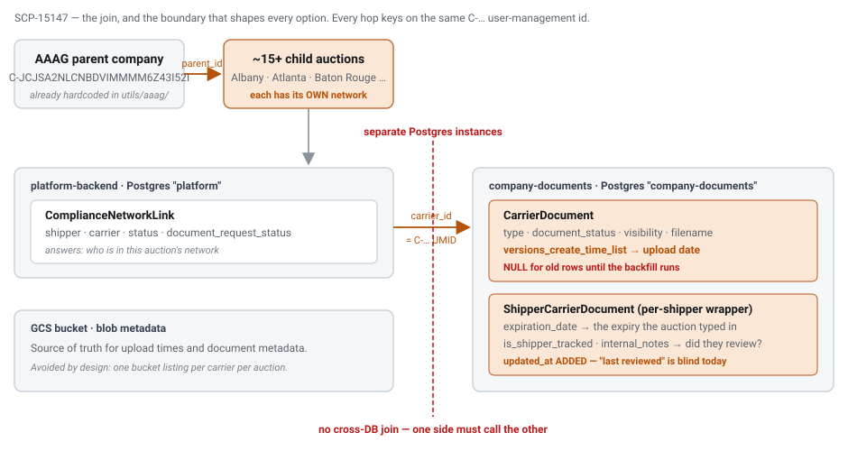

# COI report for AAAG - feasibility and effort

`SCP-15147` · **proposed** · 2026-09-03 · hristo.savov@ship.cars · groomed 2026-09-03 (re-groomed)

**Services:** `ml-central-data-storage`, `company-documents`, `platform-backend`, `airbyte`, `metabase`

**Legend:** 🟢 added · 🟡 updated · 🔴 removed · 🔵 reused

## Context

> **Supersedes the 2026-09-02 record.** On 2026-09-03 the story was updated with `AAAG_LMP_COI Tracker_Reporting Request_Form (1).xlsx` — the org's **Databricks report-request form** plus a **659-row sample report**. It narrows the ask substantially and corrects two facts the earlier record got wrong. Every source fact below was re-verified against the deployed branches.

AAAG mandate their auctions to hold a current Certificate of Insurance for every hauler. The requester (Business Development) wants a weekly report answering two questions: **which auctions still have carriers outstanding**, and **which carriers' COIs are expiring**.

**The ask is narrower than the story's AC.** A working report already exists — built in Metabase by the BI/reporting owner — and three of its six columns are filled in **by hand**. The form's own words: *"See 'COI Report' Tab for the three columns of data that we can't pull today that are manual… The other data points we can currently pull via Metabase… We just need the ability for him to pull in these few fields that currently aren't available."* So the deliverable is making three fields queryable next to the other three, not building a report product.

The sample tab specifies the artefact exactly: **6 columns, one row per (auction, carrier)** — `Auction Name`, `Carrier Name`, `Status`, `COI` (Yes/No), `Upload Date`, `Expiration Date` — across **49** America's Auto Auction child auctions and 526 carriers.

**Why the answer is Databricks.** The report spans three domains in three different Postgres databases: the auction hierarchy (`posting`), network membership and company names (`production`), and the COI facts (`company_documents`). Postgres cannot join across databases and no `postgres_fdw`/`dblink` is provisioned, so the join is **structurally impossible** in Metabase — which is precisely why three columns are typed in by hand. In the Databricks lakehouse all six tables are schemas in one catalog and the join is one statement.

That path is already fully built and needs **zero pipeline work**:

- Airbyte CDC already replicates `production` (incl. `users_company`, `compliance_network_compliancenetworklink`) and **all** of `company_documents` into the Databricks bronze volumes, configured `non_breaking_schema_updates_behavior = "propagate_fully"` with new-column backfill — so the columns added on 2026-08-07 propagate automatically.
- All six silver transformations already exist and are wired into the `dev` **and** `prod` pipeline library globs.
- The same request form has been filed twice before as **RE-975** and **RE-977** under epic **RE-976 "Reporting Requests"**, both `Done`, each delivered as a **single ~180-line file** in `ml-central-data-storage`.

So the only new artefact is **one gold materialized view**. No new endpoint, no event, no application deploy. This replaces the earlier record's plan for a `company-documents` report endpoint, a Django network-list endpoint and a `posting-backend` Temporal scheduled report — all three are now unnecessary.

**Two corrections to the 2026-09-02 record:**

1. `company_documents` and `production` are **separate databases on the *same* Cloud SQL instance** (`platform`), not separate instances. That matters twice over: a BI read replica (`platform-replica-analytics`) already physically carries both, so exposing the COI tables to Metabase is a GRANT rather than new infrastructure — but they are still separate *databases*, so a single-query join remains impossible.
2. `compliance-statuses` now returns `expiration_date` **ungated** by `is_shipper_tracked` (SCP-14905, on production), and wrapper status no longer masks a non-active document (SCP-15092). The earlier record invented a new endpoint partly to work around gating that no longer exists.

**One blocker survives.** Three independent 60-day prod log searches found no evidence the metadata backfill has ever run. Four commits landed on `origin/production` on **2026-08-07** under SCP-14461 — `3ddc910` (migration `0fa047cb2bea`, the denormalized columns + tracking flag), `6e8c00d` (compliance/metadata helpers), `bcbf0f9` (**the one-off GCP→DB metadata backfill script**), `29a2402` (tests) — and every upload since writes the values on the write path (`apply_document_metadata` at `carrier_document_route.py:82`, `shipper_document_route.py:78`, re-sync `:276`/`:325`). But the sample's upload dates reach back to **2023-07-06**, so most of the corpus predates that and still depends on the backfill. Documents with `type = NULL` are invisible to a `type='cargo_insurance'` filter: the report would come back near-empty while *looking* correct. The sample's **443 COI=Yes** is the oracle that detects this.

**This reconciles the requesting thread's conclusion, which was that the report cannot be built.** Three of its claims hold — it genuinely cannot be built in Metabase (separate databases, no `postgres_fdw`), a prior Databricks attempt at a carrier-insurance report left nothing committed on any branch, and the expiration-date limitation is real. The load-bearing claim — *"the data required is not presented in the database; it can be found only in metadata of the bucket… maybe a script that will add the data into a new column"* — was **already out of date when it was written**, by roughly 3–4 weeks: the columns exist, the write path populates them, and the proposed script is `scripts/backfill_document_metadata.py`. Where that diagnosis remains effectively correct is exactly this blocker — for pre-2026-08-07 documents the values *are* still only in bucket metadata until the backfill runs. Same fact, two sides. **So the scoping question behind this ticket — "a small tweak or a major architectural change?" — resolves to a small tweak:** the architectural change shipped on 2026-08-07; what remains is running an existing script, one GRANT, and one gold view.

**One limitation is deliberate, not a gap.** `expiration_date` is **shipper-entered**, not parsed from the document, and **68 of the 443 shared COIs in the sample have none** (15%). Per the carrier PO this is by design — the auction must open and verify the document, because a carrier could enter any date and even machine-reading the file could not establish that it is valid. **So CPDR-424 "COI Data Parsing" would not close this gap.** For the report this means a blank expiration is meaningful output — *"this auction has not reviewed this document yet"* — arguably its most actionable signal, rather than a defect to suppress.

## §2a · PostgreSQL

*Column delta · `ShipperCarrierDocument` (database `company_documents`, instance `platform`) — the only schema change in the design; independent of which report route is chosen*

| Column | Type | Change | Null | Default / backfill |
| --- | --- | --- | --- | --- |
| `updated_at` | `DateTime` | 🟢 added | y | `default=now()`, `onupdate=now()`; **not retroactive** — answers "when did this auction last review this document" only from ship date forward |
| `created_at` | `DateTime` | 🔵 reused | n | the only write timestamp on the row today, which is why `updated_at` is needed |
| `expiration_date` | `DateTime` | 🔵 reused | see note | report column 6. Shipper-entered; blank for 68/443 shared COIs. Model declares `nullable=False` but migration `d5f4426bee2f` created it nullable — verify live schema before relying on NOT NULL |
| `is_shipper_tracked` | `Boolean` | 🔵 reused | n | added by `0fa047cb2bea`; gates compliance display, **not** `expiration_date` (SCP-14905) |
| `status` | `String` | 🔵 reused | n | `'active'` is half the sharing predicate |

*Data delta (no schema change) · `CarrierDocument` (database `company_documents`)*

| Column | Type | Change | Null | Default / backfill |
| --- | --- | --- | --- | --- |
| `type` | `String` | 🟡 backfill required | y | added `0fa047cb2bea` (2026-08-07). **NULL for every earlier document until `scripts/backfill_document_metadata.py` runs.** Report filters `type = 'cargo_insurance'` exactly — the sibling enum member `certificate_of_insurance` = `"certificate_insurance"` is referenced by no route |
| `versions_create_time_list` | `String` | 🟡 backfill required | y | comma-joined version timestamps; report column 5 = `element_at(split(…, ','), -1)`. Same NULL exposure |
| `document_status` | `String` | 🔵 reused | y | `'active'` is the other half of the predicate |
| `visibility` | `String` | 🔵 reused | y | `'public'` + no wrapper row = shared without the auction ever engaging |

*Read-only access delta · database `company_documents` on replica `platform-replica-analytics`*

| Grant | Type | Change | Null | Default / backfill |
| --- | --- | --- | --- | --- |
| `CONNECT` on `company_documents` for role `analytics` | grant | 🟢 added | — | role already exists instance-level (`platform/locals.tf:23-30`) |
| `SELECT` on `CarrierDocument`, `ShipperCarrierDocument` for `analytics` | grant | 🟢 added | — | two tables only; nothing else |

## §2c · Databricks gold view

*New materialized view · `gold_{env}_catalog.internal_reports.AaagLmpCoiTracker` — the design's primary deliverable. One row per (auction, carrier).*

| Column | Type | Change | Source (silver) | Note |
| --- | --- | --- | --- | --- |
| `auction_name` | `string` | 🟢 added | `posting_core.company.name` | scoped by `external_parent_company_id`; parameterise on parent **name** so it serves all LMP partners, not just AAAG |
| `carrier_name` | `string` | 🟢 added | `production_platform.users_company.name` | 526 distinct in the sample |
| `status` | `string` | 🟢 added | `compliance_network_compliancenetworklink.status` | sample holds only `verified` \| `suspended` \| `under_review` — 3 of the model's 5 values. Filter must be explicit (**Q3**) |
| `coi` | `string` | 🟢 added | `carrierdocument` + `shippercarrierdocument` | `'Yes'`/`'No'`. Predicate copied verbatim from `shipper_document_route.py:427-438`: `type='cargo_insurance' AND document_status='active' AND (visibility='public' with no wrapper OR wrapper.status='active')` |
| `upload_date` | `date` | 🟢 added | `carrierdocument.versions_create_time_list` | `element_at(split(…, ','), -1)`; string parse with an ordering assumption (**Q2**) |
| `expiration_date` | `date` | 🟢 added | `shippercarrierdocument.expiration_date` | the **wrapper's** DateTime, *not* `CarrierDocument.expiration_date` (a nullable String copied from blob metadata) |
| six silver tables | — | 🔵 reused | — | all exist, all wired into the `dev` + `prod` pipeline globs; every join carries `__END_AT IS NULL AND _ab_cdc_deleted_at IS NULL` |
| bronze ingestion | — | 🔵 reused | Airbyte CDC | `propagate_fully` + new-column backfill — no pipeline change needed |
| `user_ids` / row-level security | — | 🔴 removed | — | not applicable: this is an **internal** report in `internal_reports`, not a customer-embedded dashboard, so the `user_ids` RLS column the `executive_dashboards` gold views carry is deliberately absent |

## §4 · REST API & DTO

**No delta.** The recommended design adds and changes no endpoint, DTO field or published event anywhere in the fleet.

| Surface | Change | Note |
| --- | --- | --- |
| `GET /{company_id}/compliance-statuses` | 🔵 reused | read for its sharing predicate only; **not called** by the report — the warehouse reads the replicated tables. Healthy in prod (8× 200 / 0 errors in the 3 days to 2026-09-03) |
| `GET /{company_id}/coi-report` | 🔴 removed | proposed by the 2026-09-02 record; **no longer needed** |
| Django internal "list a shipper's network" endpoint | 🔴 removed | proposed by the 2026-09-02 record; **no longer needed** |
| `posting-backend` Reporting report type + Temporal schedule | 🔴 removed | proposed by the 2026-09-02 record; over-engineering against the actual ask |
| any service-to-service read of the gold view | 🔴 removed | **not possible.** A fleet-wide audit (2026-09-03) found nothing in the fleet runs SQL against Databricks — no `jdbc:databricks`, no `DatabricksJDBC`, no `databricks-sql-connector`, no `/api/2.0/sql/statements`, and no repo declares a Databricks SDK. `bi-databricks-backend` is an **OAuth + embed-token broker only** (`POST /oidc/v1/token`, `GET /api/2.0/lakeview/dashboards/{id}/published/tokeninfo`) and never reads data; the only programmatic consumption pattern is an embedded AI/BI dashboard querying from the browser via `@databricks/aibi-client`. The view is therefore consumed by a human or by an embed — never by a backend |

## Where it lives & how it's wired

| Aspect | Detail |
| --- | --- |
| report service | `ml-central-data-storage` · `transformations/gold/Internal_Reports/Aaag_Lmp_Coi_Tracker.py` (new; template `Posted_Vs_Dispatched_Price_Gap.py`, RE-975) |
| report tests | `ml-central-data-storage` · `transformations/tests/gold/` · pattern `tests/gold/AAAG/gold_gx_aaag.py:27-50` → results to `audit_{env}_catalog` |
| column-owning service | `company-documents` · `api/models/{carrier_document,shipper_carrier_document}.py` · migration `0fa047cb2bea` · backfill `scripts/backfill_document_metadata.py` |
| branch to work from | `company-documents` → **`origin/production`** (`4269067`); `ml-central-data-storage` → **`origin/dev`** (`e63fe62`). Both repos' `master` is ~4 months stale and lacks this feature |
| instance | `platform` (POSTGRES_18, `db-custom-16-40960`) · DB `company_documents` **and** DB `production` — same instance, **different databases** |
| BI replica | `platform-replica-analytics` (read replica of the `platform` instance) · 6 vCPU · `max_standby_streaming_delay = -1` · carries both databases |
| BI tool | Metabase — the internal-only support instance (`nginx-internal`; owner recorded as a podLabel in its helm values) |
| ingestion | Airbyte CDC → GCS Parquet → `bronze_{env}_catalog` · `production` at `0 0 2,14` UTC, `company_documents` at `0 15 2,14` UTC |
| pipeline refresh | Databricks `ml_central_data_storage_refresh` · `0 0 11,16` GMT · `UNPAUSED` in prod, **`PAUSED`** in staging |
| consumption | human (Databricks UI / Metabase) or an embedded AI/BI dashboard via the token broker — **no backend read path exists fleet-wide** |
| topic | none — no Pub/Sub delta |
| ES index | none — no Elasticsearch delta |
| jira home | the report belongs under epic **RE-976 "Reporting Requests"**; SCP-15147 correctly owns the `company-documents` backfill prerequisite |

## Rollout

> ⚠️ **§5 · rollout & sequencing**
>
> Prove the data before materialising anything — a silently under-reporting compliance report is worse than none.
>
> 1. **Measure the backfill (blocks every estimate).** `scripts/backfill_document_metadata.py --scan-only` (read-only), then `SELECT count(*) FROM "CarrierDocument" WHERE type IS NULL`. If it has not run, `--dry-run` then run it for real and record its four tallies.
> 2. **Grant + add the Metabase data source** on `platform-replica-analytics` (parallel with step 1 — each is the other's proof). This **unblocks the report owner this week** and immediately measures backfill coverage against the sample's **443 COI=Yes / 447 upload dates**.
> 3. **Verify silver reality.** `DESCRIBE` the six silver tables and `SELECT MAX(_ingest_time)`; confirm `type`, `versions_create_time_list`, `expiration_date`, `is_shipper_tracked`, `external_parent_company_id`, `user_management_id` actually landed. Airbyte's `propagate_fully` says they should; silver's schema is auto-inferred, so prove it.
> 4. **Answer Q1–Q4** (expiration gap · which upload date · which statuses · AAAG-only vs all LMP partners) — these change column semantics, not plumbing.
> 5. **Add `ShipperCarrierDocument.updated_at`** — independent, do it early, it is not retroactive.
> 6. **Build the gold view in `dev`**, reconcile against the sample (49 auctions / ~659 rows / ~443 Yes), add the GX suite, then promote to `prod`. **Do not plan a staging sign-off** — staging's library globs exclude `company_documents_platform`, `production_platform` and AAAG gold, and its refresh job is `PAUSED`.
>
> **Risk:**
> - **Backfill unevidenced** — three independent 60-day searches found nothing; NULL `type` makes documents *silently absent* rather than flagged. Steps 1–2 exist for this.
> - **Silver column presence unproven** — silver declares no schema and its only data-quality check is `__START_AT IS NOT NULL`, so nothing would have alerted if the 2026-08 columns never arrived.
> - **No staging validation path** — validate in `dev`, promote to `prod`.
> - **Freshness is ~12–24h end to end** (Airbyte twice daily → Databricks twice daily). Ample for a weekly report; do not describe the output as live.
> - **Delivery is a queryable table, not a pushed file — and that is structural, not a gap in this repo.** A fleet-wide audit (2026-09-03) found **no service-to-service query path into Databricks anywhere**: the only programmatic consumption pattern is an embedded AI/BI dashboard, and `ml-central-data-storage` has no email or export mechanism either. So the view is read by a human in the Databricks UI or via an embed — no backend can consume it. A Databricks SQL subscription or export job is a follow-up, not part of this estimate, and would be the first of its kind in the fleet.
> - **The sample itself is partly corrupt** — one expiration cell reads literally `Oct`, five rows say COI=`No` yet carry dates. Reconciliation must expect the *sample* to be wrong in those places, not the query.
> - **Tier 2 must not become permanent** — the Metabase grant leaves a manual lookup step. Label it a bridge, or the days-of-support-work problem simply returns in a faster form.
