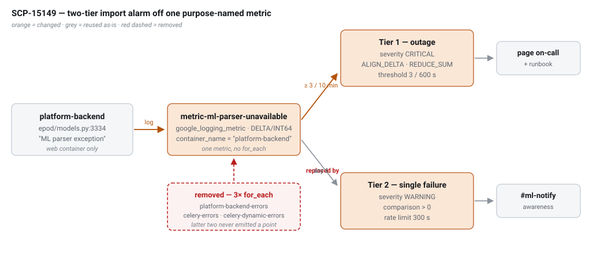

# Alarm for Importing Issues

`SCP-15149` · **proposed** · 2026-09-02 · hristo.savov@ship.cars · groomed 2026-09-02

**Services:** `devops-tf-live-shipcars-platform-prod`, `devops-tf-live-shipcars-platform-qa`, `devops-tf-live-shipcars-platform-staging`, `devops-tf-live-shipcars-platform-dev`, `platform-backend`

**Legend:** 🟢 added · 🟡 updated · 🔴 removed · 🔵 reused

## Context

**The alarm this ticket asks for already exists.** A `google_logging_metric` + `google_monitoring_alert_policy` pair filtering `jsonPayload.message="ML parser exception"` and notifying Slack `#ml-notify` was added on 2025-07-31 under `SCP-12557` (`9de0dec Adds ml parser alarms (#107)`), and is live in prod, qa and staging. The deliverable here is therefore **retuning and repairing** it, not building it.

It is distrusted because **SCP-15088 silently inverted its meaning**. Before that change, `LOG.exception('ML parser exception', …)` fired on the *first* ML failure and the Peruse fallback then rescued the import — the alert meant "ML degraded, self-healed". After it, the same string fires only once all 5 attempts are exhausted and the user receives HTTP 408 — the alert now means "customer-facing import outage". The string moved `api/order_api.py` → `epod/models.py` unchanged, so the terraform filter still matches; nothing was retuned to match the new severity.

Five verified defects:

1. **QA is dark.** The metric is named `qa-${each.value}-errors` while the policy filters `${each.value}-errors` — it references a metric that does not exist and can never fire. The `qa-` prefix appears in no other metric in that repo.
2. **"Several times in a given time period" is not expressible.** The policy uses `ALIGN_MEAN`/`REDUCE_MEAN` with no `threshold_value` (defaults to `0`). With `REDUCE_MEAN`, 6 failures across 3 pods reduce to a mean of 2, so a threshold of 5 would never fire despite 6 real failures.
3. **Dev has no alarm**, and no `cluster_name`/container-list scaffolding to hang one on.
4. **Misleading identity.** The metric is named `platform-backend-errors` and titles itself "platform-backend errors detected" though it matches only ML-parser exceptions; it carries no `severity` and no runbook.
5. **`for_each` over three containers, two permanently dark.** `ParserService` is instantiated once fleet-wide (`epod/models.py:3306`) on the synchronous gunicorn path only — `celery-errors` and `celery-dynamic-errors` never receive a data point.

Two failure modes that mean "import is unavailable" are **invisible** to any parser-only filter: `Parser parse exception` (upload/signing failure, raised outside the guarded block) and `ML parser validation error`. Conversely the alarm can fire on a **healthy** parser: `ml-document-parser`'s worst case is ~30 s (5 parallel Gemini calls, 15 s × 2 retries) against platform-backend's 25 s per-attempt timeout.

The design keeps the signal on the caller side because **no other signal exists**: the parser logs failures as HTTP 417 at INFO in plain text, its readiness probe only checks Postgres (never Gemini), and `Instrumentator(...).instrument(app)` is wired but `.expose()` is never called, so there is no `/metrics` route to scrape.

## §5 · Monitoring resources

*No data-model, event, or REST/DTO delta — this change is entirely GCP Cloud Monitoring resources plus one optional structured log field.*

*Resource delta · `live/monitoring/` (prod; staging mirrors)*

| Resource | Type | Change | Name | Notes |
| --- | --- | --- | --- | --- |
| log metric | `google_logging_metric` | 🟢 added | `metric-ml-parser-unavailable` | single metric, no `for_each`; filter pins `container_name="platform-backend"` + `jsonPayload.message="ML parser exception"` |
| log metric | `google_logging_metric` | 🔴 removed | `ctms_parser_error_logs_metric` | 3× `for_each`; frees the squatted `platform-backend-errors` name |
| alert policy | `google_monitoring_alert_policy` | 🟢 added | `ml_parser_outage_alert_policy` | Tier 1 · `severity=CRITICAL` · `ALIGN_DELTA`+`REDUCE_SUM` · `threshold_value=N` over the agreed window |
| alert policy | `google_monitoring_alert_policy` | 🟢 added | `ml_parser_failure_alert_policy` | Tier 2 · `severity=WARNING` · `> 0` · `notification_rate_limit { period = "300s" }` |
| alert policy | `google_monitoring_alert_policy` | 🔴 removed | `carrier_parser_error_logs_alert_policy` | 3× `for_each`; `ALIGN_MEAN`/`REDUCE_MEAN`, no `threshold_value`, no severity |
| notification channel | `google_monitoring_notification_channel` | 🔵 reused | `ctms_parser_alerts_slack_channel` | `#ml-notify`; Tier 1 routing to `#mon-prod` is an open question |
| contract test | `.tftest.hcl` | 🟢 added | `ml_parser_alarm_contract` | asserts metric name ↔ policy `metric.type`, thresholds, severities, channel |

*Metric-name fix · qa only*

| Resource | Type | Change | Name | Notes |
| --- | --- | --- | --- | --- |
| log metric | `google_logging_metric` | 🟡 renamed | `qa-*-errors` → `*-errors` | `metrics-ctms-parser-error-logs.tf:6`; makes qa match its own policy filter and become identical to staging/prod |

*Log field delta · `platform-backend` (optional, pending Q3)*

| Field | Type | Change | JSON name | Consumer action |
| --- | --- | --- | --- | --- |
| `import_stage` | `str` (`upload`\|`parse`\|`validate`) | 🟢 added | `jsonPayload.import_stage` | metric filter widens to an `OR` over the three import-failure messages |
| `attempts` | `int` | 🔵 reused | `jsonPayload.attempts` | already emitted at `epod/models.py:3334`; no change |

## Where it lives & how it's wired

| Aspect | Detail |
| --- | --- |
| service | `devops-tf-live-shipcars-platform-{prod,qa,staging,dev} · live/monitoring` |
| files | `metrics-ctms-parser-error-logs.tf`, `monitoring-ctms-parser-alerting-policy.tf`, `slack_channels.tf`, `locals.tf` |
| reuse templates | `metrics-twilio-errors.tf` + `monitoring-twilio-errors-alert-policy.tf` (single metric, severity, runbook); `monitoring-lb-policy.tf:14-30` (`threshold_value`+`REDUCE_SUM`); `monitoring-lm-alerting-policy.tf:79-83` (`notification_rate_limit`) |
| signal source | `platform-backend · epod/models.py:3334` (`LOG.exception`), retry loop `:3298-3341`, client `epod/parser_service.py:4,41` |
| entry points | `platform-backend · api/order_api.py:3877-3939` — 4 DRF actions, all synchronous gunicorn; HTTP 408 on exhaustion |
| instance | GKE `k8s_container` · cluster/namespace `production` · project `shipcars-platform-prod` |
| container | `platform-backend` (web) — **not** `celery`/`celery-dynamic` |
| channel | Slack `#ml-notify` via `ctms_parser_alerts_slack_channel` (`slack_channels.tf:83-93`) |
| apply path | Atlantis — PR touching `live/monitoring/*.tf` → autoplan → human approve → `atlantis apply`; **no test step in the workflow** (`atlantis.yaml:220-228`) |
| ruled out | `alert-enricher` (ingress hard-coded to Cloud SQL CPU, `gcp_incidents.py:365-368`); `ml-document-parser` (no server-side signal exists today) |

## Rollout

> ⚠️ **§5 · rollout & sequencing**
>
> Verify-before-change, then lowest-risk environment first.
>
> 1. **Verify the signal.** Re-authenticate the CLI and confirm `jsonPayload.message="ML parser exception"` matches a real entry in `shipcars-platform-prod`. Everything downstream assumes this filter works. An empty 30-day result is **ambiguous** — cross-check the higher-volume `ML parser retry` warning line before concluding the filter is broken.
> 2. **Fix QA** — drop the `qa-` prefix. Independent of everything else and restores the environment used to validate the rest.
> 3. **Decide `N` and the window** (and the environment scope). This blocks Tier 1's terraform and nothing else.
> 4. **Retune staging, then prod** — staging is the only non-prod env with the alarm live *and* real traffic (61 parses/24 h), so calibrate the Tier 1 threshold there before production.
> 5. **Close the blind spots** (optional, pending Q3) — add `import_stage`, then widen the filter, as one reviewable diff after the retuned filter is live.
> 6. **Add the contract test** with or just after step 4.
>
> **Risk:**
> - `severity` is emitted lowercase (`"error"`, `epod_logging.py:191`) — the current filter does not depend on it, but any **new** severity clause must be verified against a real log entry, not assumed.
> - The 25 s client timeout is *below* the parser's ~30 s worst case, so sustained slowness is indistinguishable from an outage; Tier 1 will fire on a healthy-but-slow parser. Raising the timeout is deliberately **not** folded into this ticket.
> - Removing the three `*-errors` resources and adding new ones is a destroy-and-create in one plan — review the Atlantis plan for unintended deletions, since the names are generic enough to be reused elsewhere.
> - Atlantis has no test step, so nothing automatically prevents a repeat of the QA name mismatch until step 6 lands.
