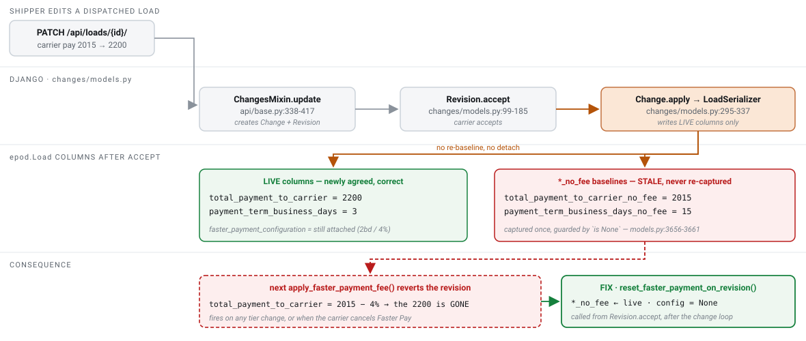

# Differentiate Shipper Revision from Faster Pay

`SCP-15157` · **proposed** · 2026-09-03 · hristo.savov@ship.cars · groomed 2026-09-03

**Services:** `platform-backend`, `syncer`, `cube`, `models-lib`

**Legend:** 🟢 added · 🟡 updated · 🔴 removed · 🔵 reused

## Context

**This story describes a product rule, but on Django HEAD it is a live, reachable data-corruption defect — and the corruption is worse than the ticket says.** Reviewed against `platform-backend` `origin/master` = `c6e2900f` (2026-09-03), four merged PRs ahead of the locally checked-out `1951e060`.

`apply_faster_payment_fee()` (`epod/models.py:5251-5271`) treats the `*_no_fee` columns as the authoritative baseline and recomputes the live carrier-pay and payment-term columns from them on every call. Those baselines are captured **once, only while still `NULL`** — both capture sites (`Load.save()` at `epod/models.py:3656-3661` and the top of `apply_faster_payment_fee` at `:5252-5257`) are guarded by `is None`. Nothing ever re-captures them.

`Revision.accept()` (`changes/models.py:99-185`) applies the shipper's newly agreed values onto the **live** columns via `LoadSerializer.update()` (`:150-155` → `:295-337`), leaving the baselines holding pre-revision values with the Faster Pay tier still attached. Three failures follow:

1. **The revision is silently reverted.** The next `apply_faster_payment_fee()` — a tier change, or the carrier *cancelling* Faster Pay — recomputes `total_payment_to_carrier` from the stale `carrier_pay_no_fee`, discarding the shipper's revised carrier pay; on a cancel the term resets to the stale `_no_fee` term. This is literally the ticket's "forcing a carrier pay and a payment term to which neither the shipper, nor the carrier have agreed to", and it fires without anyone touching the revision again.
2. **The fee and receivables are computed off the wrong number** from the moment the revision is accepted — `faster_payment_fee_amount` → `receivables_no_fee` → `carrier_pay_no_fee` (`epod/models.py:5219-5238`) all read the stale baseline.
3. **The invoice keeps the pre-revision fee and term.** `_refresh_invoice_carrier_pay()` (`epod/models.py:4661-4680`) early-returns while `self.active_revision` is set, and `Revision.accept()` never calls it afterwards — it only calls `order.create_dispatch_sheet()` (`changes/models.py:184-185`).

The decision: add `Load.reset_faster_payment_on_revision(changed_fields)` and call it from `Revision.accept()` immediately after the change-apply loop. That is the only site in the codebase that means "the carrier agreed to the shipper's new terms" **and** sits outside the fee-application path.

A hook in `Load.save()` keyed on `changed_fields` is the obvious alternative and is **wrong**: `apply_faster_payment_fee()` itself mutates `total_payment_to_carrier` and `payment_term_*`, so those fields are always in `changed_fields` on the very save that attaches a tier — the hook would detach the tier it had just attached. This is the decisive constraint on the design.

**No contract delta.** `faster_payment_enabled` and `faster_payment_configuration` are already mapped end-to-end into both ES indices (`CtmsOrderDocumentConverter.java:487-489`), and `LoadDto` is `@JsonIgnoreProperties(ignoreUnknown = true)` (`LoadDto.java:12`). Existing fields change *value* only — `syncer`, `cube` and `models-lib` need no code change.

## §2a · PostgreSQL

*No schema delta — the three baseline columns already exist. What changes is **when** they are written.*

*Write-semantics delta · `epod_load`*

| Column | Type | Change | Null | Default / backfill |
| --- | --- | --- | --- | --- |
| `total_payment_to_carrier_no_fee` | `numeric(8,2)` | 🟡 updated | y | re-captured from the live column on revision-accept; previously written once while `NULL` (`epod/models.py:3660`) |
| `payment_term_business_days_no_fee` | `smallint` | 🟡 updated | y | same — re-captured on revision-accept |
| `payment_term_calendar_days_no_fee` | `smallint` | 🟡 updated | y | same — added by `#3100` (migration `0323`), so both unit types are now covered |
| `faster_payment_configuration_id` | `bigint` FK → `users_fasterpaymentconfiguration` | 🟡 updated | y | set to `NULL` when a payment-affecting revision is accepted |
| `total_payment_to_carrier` | `numeric(8,2)` | 🔵 reused | y | the shipper's newly agreed value survives — that is the point of the fix |
| `payment_term_business_days` / `payment_term_calendar_days` | `smallint` | 🔵 reused | y | ditto |

*Trigger set · the six fields whose revision cancels Faster Pay*

| Story wording | Column(s) | Change | Evidence |
| --- | --- | --- | --- |
| Carrier Pay | `total_payment_to_carrier` | 🟢 added to trigger set | `epod/models.py:2411` |
| the receivables | `payment_on_pickup`, `payment_on_delivery` | 🟢 added to trigger set | `receivables` is computed; `_calculate_payment` (`epod/models.py:5277-5286`) subtracts exactly these two |
| the payment term | `payment_term_business_days`, `payment_term_calendar_days`, `payment_term_begins` | 🟢 added to trigger set | `epod/models.py:2413-2416` |
| — | `payment_method` | 🔵 reused | deliberately excluded: `Load.save()` already re-resolves `faster_payment_enabled` on moves into/out of `smarthaul_payments` (`epod/models.py:3648-3651`, SCP-15052 / `#3087`) |

There is **no existing revisable-field whitelist** to borrow — `ChangesMixin` revisions *any* changed field (`api/base.py:338-417`) — so this set has to be authored. `Load.PAYMENT_FIELDS` (`epod/models.py:3196-3210`) is a superset used for sub-order propagation; do not reuse it verbatim.

## §3 · Pub/Sub event

*`LoadDto` on `BROADCAST_EVENTS_TOPIC` — no field delta, values change*

| Field | Type | Change | JSON name | Subscriber action |
| --- | --- | --- | --- | --- |
| `fasterPaymentConfiguration` | `FasterPaymentConfigurationDto` | 🔵 reused | `faster_payment_configuration` | none — becomes `null` after a payment-affecting revision; already mapped by `syncer` (`CtmsOrderDocumentConverter.java:488`) |
| `fasterPaymentEnabled` | `Boolean` | 🔵 reused | `faster_payment_enabled` | none — unchanged by this story; still means "eligible shipper + `smarthaul_payments`" |
| `totalPaymentToCarrier` | `Double` | 🔵 reused | `total_payment_to_carrier` | none — now correctly carries the shipper's agreed value instead of a fee-adjusted stale one |
| `paymentTermBusinessDays` / `paymentTermCalendarDays` | `String` / `Integer` | 🔵 reused | `payment_term_business_days` / `payment_term_calendar_days` | none |

Published via `EventMixin` → `EventSubscription.send_event` → `send_pubsub` (`users/models/user_models.py:3049-3069`). Consumed by `CtmsOrdersIndexListener` (`loads` index) and `CtmsLoadboardIndexListener` (`postings` index).

## §4 · REST API & DTO

*No delta.* `POST /api/revisions/{id}/accept/` (`api/changes/__init__.py:74-79`) keeps its request and response shape. The `_no_fee` columns are already `read_only_fields` on `LoadSerializer` (`api/order_api.py:2284`) and `faster_payment_configuration` is already `read_only=True` (`:2240-2243`), so the reset surfaces through the existing load representation with no serializer change.

## Where it lives & how it's wired

| Aspect | Detail |
| --- | --- |
| service | `platform-backend` · Python 3.12 / Django 6.0.4 / gunicorn WSGI |
| new method | `Load.reset_faster_payment_on_revision(changed_fields)` — `epod/models.py`, beside `apply_faster_payment_fee` (`:5251`) |
| call site | `Revision.accept()` — `changes/models.py:99-185`, immediately after the `change.apply()` loop (`:150-155`) |
| endpoint | `POST /api/revisions/{id}/accept/` → `RevisionViewSet.accept` (`api/changes/__init__.py:74-79`, `CarrierOnlyPermission`) → `ActionViewSetMixin.perform_action` (`api/actions.py:60-87`) |
| revision creation | `ChangesMixin.update` (`api/base.py:338-417`) → `Change.get_or_create_change` → `Revision.get_or_create_revision` (`changes/models.py:68-91`) |
| reused | `apply_faster_payment_fee()` (`:5251-5271`), `_refresh_invoice_carrier_pay()` (`:4661-4680`), `create_dispatch_sheet()`; the pattern to mirror is `set_faster_payment_configuration()` (`:4648-4660`) |
| transaction | implicit — `ATOMIC_REQUESTS: True` on the default DB (`epod_project/settings.py:174`); no explicit `transaction.atomic` needed |
| instance | Cloud SQL Postgres · `core` · DB `epod` |
| topic | `BROADCAST_EVENTS_TOPIC` (`cars.ship.{env}.…`) via `EventSubscription.send_pubsub` |
| ES indices | `loads` (`CtmsOrdersIndexListener`) and `postings` (`CtmsLoadboardIndexListener`) — both already carry the fields |
| tests | `api/tests/test_faster_payment_configuration.py` — reuse `create_load(payment_method='smarthaul_payments')` and the `active_config_*` fixtures |
| ruled out | `syncer` / `cube` / `models-lib` (already wired, additive-safe); `loadboard-frontend` / `carrier-packages-frontend` (the only Faster Pay UI is the loadboard tooltip, which never sees an accepted order); `epod-ios` / `epod-android` (zero Faster Pay code — verified by grep) |

## Rollout

> ⚠️ **§5 · rollout & sequencing**
>
> Contract-free and single-repo, but coupled to SCP-15158 through the same baseline columns.
>
> 1. **Agree the six trigger fields** and write them into the story as a comment. Blocks coding; nothing else.
> 2. **Decide the ordering against SCP-15158.** After a revision lowers the term, *which* tiers are still worth electing is exactly SCP-15158's rule. Recommend landing both, 15157 first.
> 3. **Implement** `Load.reset_faster_payment_on_revision()` + the call in `Revision.accept()`, with tests. One PR, no consumer coordination.
> 4. **Verify propagation in QA** — accept a revision on a tier-bearing load and confirm the ES `loads` **and** `postings` documents show the detached tier.
> 5. **Notify ePOD (Stefan) and FE (Svilen)** that the election can now be cancelled server-side as a side effect. No API change, but a state their in-development screens must handle.
>
> **Risk:**
> - **ES last-write-wins (pre-existing).** The `loads` index write goes through `getUpdateOperationWithDocumentVersionCheck` with `version = update_time` epoch millis (`ElasticIndexManager.java:468-498`; on by default via `syncer.ctms-orders.document-version-check-enabled`). An event not strictly newer than what ES holds is silently dropped (`ctx.op = 'none'`), so CTMS order details could keep showing the cancelled tier. The `postings` index is not version-checked. This is the most likely "fixed in Django, still wrong in the UI" report.
> - **Existing corrupt rows.** Loads whose revision was already accepted while a tier was attached have stale baselines *right now*. Backfill/audit or forward-only is an open decision.
> - **Carrier-initiated revisions auto-accept** inline (`api/order_api.py:2938-2967`). The field-intersection test makes this mostly moot, but the intended behaviour must be explicit or it is accidental.
> - **The reset is silent.** `Revision.accept()` emails the shipper (`changes/models.py:217-228`) but tells the carrier nothing. Cancelling a fee-bearing election with no notice is a support ticket waiting to happen.
> - **`faster_payment_enabled` is writable over the API** — no field override, not in `LoadSerializer.Meta.read_only_fields` (`api/order_api.py:2265-2287`). Adjacent to open bug SCP-15141; fold into that authorization pass, not this story.
