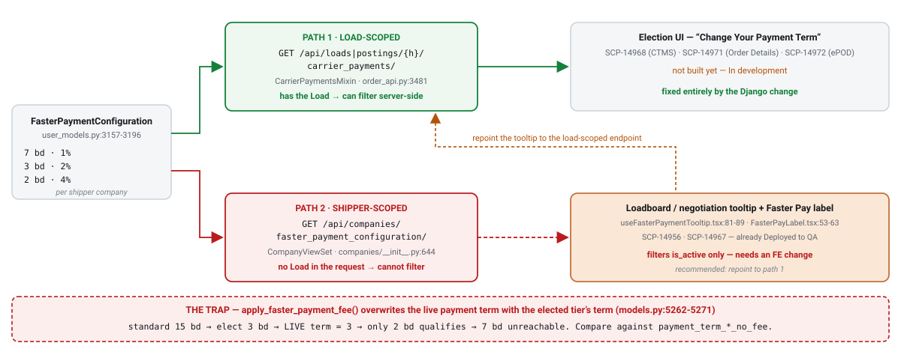

# Display Faster Pay options lower than the payment term

`SCP-15158` · **proposed** · 2026-09-03 · hristo.savov@ship.cars · groomed 2026-09-03

**Services:** `platform-backend`, `loadboard-frontend`, `carrier-packages-frontend`

**Legend:** 🟢 added · 🟡 updated · 🔴 removed · 🔵 reused

## Context

Reviewed against `platform-backend` `origin/master` = `c6e2900f` (2026-09-03). Two PRs merged **the day after this story was written** move the ground under it, and both help:

- **`#3100`** (SCP-15154) added `Load.payment_term_calendar_days_no_fee`, so the standard payment term is now recorded for *both* unit types, and `apply_faster_payment_fee()` finally branches on `terms_days_type` (`epod/models.py:5262-5271`).
- **`#3099`** removed the auto-created default tier, extracted `CarrierPaymentsMixin` (`api/order_api.py:3441-3516`), and introduced a **synthetic standard-terms option** — `id='default_faster_payment_id'`, `terms_fee: 0`, built by `_standard_terms_option()` (`:3447-3479`) from `payment_term_*_no_fee`. `Load.accept(faster_payment_configuration=None)` now *detaches* instead of falling back to `is_default`.

So the reference value this story needs — the order's *standard* payment term, independent of any elected tier — already exists and is already computed in exactly one place. **What does not exist anywhere is the comparison.** Exhaustive grep for `terms_days` across production code returns one non-admin, non-migration, non-test use: the straight assignment inside `apply_faster_payment_fee` (`epod/models.py:5266,5270`).

**The structural finding: there are two option-list read paths, and only one of them can be filtered server-side.**

1. `GET /api/loads/{hash}/carrier_payments/` and `GET /api/postings/{hash}/carrier_payments/` — `CarrierPaymentsMixin.carrier_payments` (`api/order_api.py:3481-3516`), mixed into `LoadViewSet` (`:3616`) **and** `PostingViewSet` (`:4998`). **Load-scoped**, filters `is_active=True` only (`:3489-3491`). Django can add the term filter here.
2. `GET /api/companies/faster_payment_configuration/?shipper_ids=…` — `CompanyViewSet.faster_payment_configuration` (`api/companies/__init__.py:644-660`). **Shipper-scoped**: there is no load in the request, so it physically cannot apply a per-order rule. This is what the *already-shipped* loadboard/negotiation tooltip uses — `loadboard-frontend/src/hooks/useFasterPaymentTooltip.tsx:64-92` prints the load's own term, then every active shipper tier sorted descending by `termsDays`, with no comparison against the order at all.

That means the `DJANGO`-only tag cannot deliver this AC: on today's loadboard a 3-business-day Montway load renders exactly the defect in the ticket's Problem statement. **An FE change is unavoidable**, and it lands on `SCP-14956` / `SCP-14967` — both already `Deployed to QA`.

The decision: add one predicate, `Load.eligible_faster_payment_configurations()`, and share it across the read endpoint and **both** write actions. Sharing it is what also closes open bug **SCP-15141**, which exists precisely because read and write disagree today — its own text says *"the read endpoint already returns the correct allowed set, but the write endpoints don't validate against it."* Then repoint the loadboard tooltip to the load-scoped endpoint so the rule lives in exactly one place.

**The trap.** `apply_faster_payment_fee()` **overwrites** `payment_term_business_days` / `payment_term_calendar_days` with the elected tier's term (`epod/models.py:5262-5271`), so once a carrier elects 3 business days the load's *live* term **is** 3. Comparing against the live column ratchets the option set shut — elect 3 bd, and only the 2 bd tier ever qualifies again, so 7 bd becomes unreachable. That contradicts SCP-14971 ("The carrier can change their Faster Pay preference until they deliver the order"). The comparison **must** read `payment_term_*_no_fee`, which is what `_standard_terms_option` already does.

Rejected alternative: computing the eligible list in Django and indexing it through `syncer` into ES. It would let `cube` and the loadboard read it with no FE filter, but costs new fields on `LoadDto`, both `Ctms*EntityReadDto`s, both resync SQLs, both `*DocumentDto`s, both converters, an ES mapping change and a full reindex of `loads` **and** `postings` — a large, slow blast radius for a pilot rule, and it puts a mutable shipper-config-derived list into a last-write-wins index.

## §2a · PostgreSQL

*No schema delta — the story is a read-time predicate over data that already exists.*

*Read-semantics delta*

| Column | Type | Change | Null | Default / backfill |
| --- | --- | --- | --- | --- |
| `epod_load.payment_term_business_days_no_fee` | `smallint` | 🔵 reused | y | becomes the comparison reference — **never** the live `payment_term_business_days` |
| `epod_load.payment_term_calendar_days_no_fee` | `smallint` | 🔵 reused | y | same; added by `#3100` (migration `0323`) |
| `users_fasterpaymentconfiguration.terms_days` | `smallint` | 🔵 reused | n | compared strictly `<` the standard term |
| `users_fasterpaymentconfiguration.terms_days_type` | `varchar(16)` `net_days` \| `business_days` | 🔵 reused | n | **the unresolved question** — no normalisation helper exists (see Rollout risk) |
| `epod_load.faster_payment_configuration_id` | `bigint` FK | 🔵 reused | y | the attached tier is carved out of the filter unconditionally |

## §4 · REST API & DTO

*Response delta · `GET /api/loads/{hash}/carrier_payments/` and `GET /api/postings/{hash}/carrier_payments/`*

| Field / item | Type | Change | JSON name | Consumer action |
| --- | --- | --- | --- | --- |
| the option list itself | `list[object]` | 🟡 updated | *(response body)* | **returns fewer items**; may return only the synthetic standard-terms row. Consumers must handle an options-only-standard list |
| the synthetic standard-terms row | `object` | 🔵 reused | `id = "default_faster_payment_id"` | already present via `#3099`; not a hashid — must never be fed to an id-based lookup |
| the currently attached tier | `object` | 🔵 reused | — | always returned even when it no longer qualifies, so the "Change Your Payment Term" dialog keeps its marked row (SCP-14971) |
| `faster_payment_available` | `bool` | 🟢 added | `faster_payment_available` | **proposed** additive field on the load/posting serializer so consumers gate the label without re-deriving the rule. Safe: `LoadDto` and `PostingReadDto` are `@JsonIgnoreProperties(ignoreUnknown = true)` (`LoadDto.java:12`) |
| `faster_payment_enabled` | `bool` | 🔵 reused | `faster_payment_enabled` | semantics deliberately **unchanged** ("eligible shipper + `smarthaul_payments`", `resolve_faster_payment_enabled`, `epod/models.py:2837-2843`) — overloading it would change meaning for `syncer`, `cube` and both FEs |

*Write-side validation delta*

| Endpoint | Change | Behaviour |
| --- | --- | --- |
| `POST /api/loads/{hash}/accept/` | 🟡 updated | rejects a tier outside the eligible set with 4xx (`Load.accept`, `epod/models.py:4047-4057`) |
| `POST /api/loads/{hash}/set_faster_payment_configuration/` | 🟡 updated | same (`Load.set_faster_payment_configuration`, `:4648-4660`) |
| `GET /api/companies/faster_payment_configuration/` | 🔵 reused | left alone — shipper-scoped, cannot apply a per-order rule. The loadboard tooltip migrates off it instead |

## Where it lives & how it's wired

| Aspect | Detail |
| --- | --- |
| service | `platform-backend` · Python 3.12 / Django 6.0.4 · plus `loadboard-frontend`, `carrier-packages-frontend` (React/TS) |
| new method | `Load.eligible_faster_payment_configurations()` — `epod/models.py`, beside `apply_faster_payment_fee` (`:5251`); on `Load` so the write actions can reuse it without importing from `api/` |
| read call site | `CarrierPaymentsMixin.carrier_payments` — `api/order_api.py:3482`, replacing the `is_active`-only queryset at `:3489-3491` |
| write call sites | `Load.accept()` (`epod/models.py:4047-4057`), `Load.set_faster_payment_configuration()` (`:4648-4660`) |
| term resolution to share | `_standard_terms_option` — `api/order_api.py:3451-3459` (`payment_term_calendar_days_no_fee` else `payment_term_calendar_days`, else the business-days pair; calendar wins when set) |
| config model | `users.FasterPaymentConfiguration` — `users/models/user_models.py:3157-3196` (`NET_DAYS`/`BUSINESS_DAYS`, `terms_days`, `terms_fee`, `apply_to`) |
| FE tooltip | `loadboard-frontend/src/hooks/useFasterPaymentTooltip.tsx:64-92` (unfiltered list; mixed-unit sort at `:84`) |
| FE label + gates | `src/components/FasterPayLabel.tsx:53-63`; `PostingSummary.tsx:188`, `PaymentVehiclesInfo.tsx:227`, `IconList.tsx:111` |
| FE entity layer | `carrier-packages-frontend/packages/entities-frontend-package/src/{actions,selectors,models,parsers}/fasterPaymentConfiguration.ts` (action → shipper-scoped endpoint at `actions:11`) |
| not a normaliser | `epod_project/week.py:4-38` `add_week_days` converts a business-day count to a **date**, not to a comparable count — there is no unit normaliser in the repo |
| instance | Cloud SQL Postgres · `core` · DB `epod` |
| tests | `api/tests/test_faster_payment_configuration.py` — 31 existing tests, **none** exercise term-based filtering |
| ruled out | `cube` (pure passthrough — `OrdersElasticSearchService.java:100,133`, `PostingReadDtoConverter.java:58`; its orders DTO carries one config object, not a list); `syncer` (only needed if a list were indexed — it is not); `models-lib`; `platform-frontend` / `ctms-frontend` (zero faster-payment references); `epod-ios` / `epod-android` (zero Faster Pay code today) |
| overlapping in-flight | **SCP-15154** — `Code Review`, *"[DJANGO] Use Posting payment term days instead of default faster payment config"*, same area, different assignee |

## Rollout

> ⚠️ **§5 · rollout & sequencing**
>
> Producer-before-consumer, but gated on one unresolved product question.
>
> 1. **Resolve the business-days vs net-days question.** Blocks the predicate, the tests and the FE decision — nothing can be estimated without it.
> 2. **Reconcile with SCP-15154** (in Code Review, same code, different assignee) before assigning anyone.
> 3. **Decide the loadboard mechanism** — repoint the tooltip to the load-scoped `/api/postings/{hash}/carrier_payments/` (recommended) or filter client-side. This determines whether the FE sub-task blocks on the Django one.
> 4. **`platform-backend`** — the shared predicate wired into `carrier_payments`, `accept` and `set_faster_payment_configuration`, plus the additive `faster_payment_available` boolean.
> 5. **`loadboard-frontend` / `carrier-packages-frontend`** — apply the chosen mechanism. Coordinate with SCP-14956 / SCP-14967, both already `Deployed to QA`.
> 6. **Land with (or immediately after) SCP-15157**, then close **SCP-15141** using the same predicate on the write side.
>
> **Risk:**
> - **The unit question is unanswered and blocking.** Is a 5-net-day tier "lower than" a 3-business-day term? Three business days spans five calendar days, so the honest answer is "it depends". No normalisation helper exists. Options: compare only within the same unit type and treat cross-unit tiers as ineligible; normalise via an approximation; or constrain configuration so a shipper's tiers share the load's unit type. The FE already sorts across mixed types on raw `termsDays` (`useFasterPaymentTooltip.tsx:84`), so the same ambiguity is a latent bug today.
> - **Compare against the standard term, never the live one** — otherwise the option set ratchets shut and SCP-14971's "change your preference until you deliver" is violated. This is the single easiest thing to get wrong.
> - **The already-elected tier must survive the filter** (SCP-14971, design frame `4719:73347`), or the Change-Payment-Term dialog loses its marked row. Precedent: `LoadSerializer.faster_payment_configuration` already returns an *inactive* attached tier (test `test_load_returns_assigned_faster_payment_configuration`).
> - **This removes options from a surface already Deployed to QA**, so unlike SCP-15157 it is worth a feature flag for a fast revert. Mechanism exists: `is_enabled('flag')` from `epod_project/features.py`; `loadboard-frontend/src/constants/unleash.ts` currently defines five flags, none Faster Pay.
> - **The pilot's headline metric moves.** Narrowing eligibility mechanically reduces the orders that can convert; the 5–10 % target in CPDR-436 was not set against a filtered population. Flag to product before shipping.
> - **`faster_payment_enabled` is writable over the API** (`api/order_api.py:2265-2287`: no field override, not in `read_only_fields`). If eligibility becomes server-computed, this becomes a way to override it — fold into the SCP-15141 authorization pass.
> - **Strictly-lower de-duplicates the synthetic row.** A shipper tier of 15 bd / 0 % now duplicates the standard-terms row `#3099` added, and a strict `<` filter conveniently removes it for a 15 bd order. Confirm that is intended rather than incidental.
