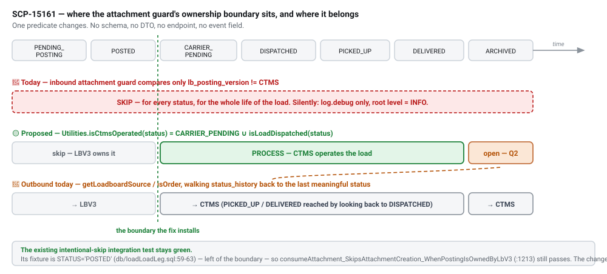

# [BE][LB] CTMS attachments are silently dropped for LBV3 loads after dispatch

`SCP-15161` · **proposed** · 2026-09-03 · hristo.savov@ship.cars · groomed 2026-09-03

**Services:** `posting-backend` (the only change), `platform-backend` (event source), `loadboard-backend` (adjacent — confirmed no alternative route)

**Legend:** 🟢 added · 🟡 updated · 🔴 removed · 🔵 reused

## Context

Reviewed against `origin/master` of `posting-backend` (`#2357`, 2026-09-01), `platform-backend` (`#3099`, 2026-09-03) and `loadboard-backend` (`#546`, 2026-08-28). **The ticket's root-cause analysis is correct in every particular.** This record captures the three things it does not say, because each one changes the work.

**1 — The guard resolves the load because the lookup filters on type, never status.** `getOnlyStandardLoadByExternalId` (`LoadBoardFacadeImpl.java:1644-1657`) sets `ordersIncluded=false / standardLoadsIncluded=true`, and those flags land in exactly one predicate — `LoadLegSpecification.addLoadTypePredicate` (`:1096-1127`) → `root.get(LoadLeg_.type).in(loadTypes)`. Status filtering is a separate method, `addStatusPredicates` (`:556-564`), which fires only when `filter.getStatuses()` is non-empty, and this filter never sets it. So a `DISPATCHED` leg resolves cleanly and `lbPostingVersion != CTMS` returns `true`.

The trap: `ordersIncluded` means `LoadTypeEnum.MANAGED_ORDER` — a **type**. `isOrder(loadLegId)` at `LoadboardDispatcherImpl.java:417` means "the last meaningful status was `DISPATCHED`/`CARRIER_PENDING`" — a **status-history** concept. Two unrelated meanings of "order" in one codebase, and the most likely reason the guard's author believed a dispatched load was already excluded.

**2 — The silence is a provable property of the log config.** The skip's only trace is the `ConsumeResult.context` string, emitted at `log.debug` (`LoadBoardStateConsumer.java:136-141`); the sibling `log.warn` at `:129` fires only past `LOG_WARNING_TIME_SPEND_MS = 7500`, which a guard that returns immediately never reaches. `logback-spring.xml:51-55` sets `<root level="INFO">` for `!local & !test & !itest` — every deployed profile — and DEBUG needs the `log-debug` / `log-debug-all` Spring profile (`:63-76`), a string that appears **nowhere else in the 232-repo fleet**. There is no environment in which this drop is observable, which is why GCP log verification is not possible until the observability change lands.

**3 — The skip is deliberate and covered by a passing test, but only pre-dispatch.** `LoadBoardStateConsumerIT.java:1213` `consumeAttachment_SkipsAttachmentCreation_WhenPostingIsOwnedByLbV3` asserts precisely this drop. Its fixture `prepareStandardLoadLeg` (`:1805-1818`) overrides only `externalLoadId` and `lbPostingVersion`; the base row from `db/loadLoadLeg.sql:59-63` carries `STATUS='POSTED'`. So a status-aware fix leaves that test green — the change is additive to a tested decision rather than a reversal of one, which is the main reason it is preferred over simply deleting the guard.

**Blast radius is materially wider than the AC.** Three cases the ticket does not mention:

- **Every ePOD-captured document, not just `type=other`.** CTMS `Attachment.clean()` (`epod/models.py:628-631`) *requires* a vehicle for `pickup_bol`, `delivery_bol`, `pickup_signature`, `delivery_signature`, `pickup/delivery_damages_picture`, `pickup/delivery_odometer_picture`. Those events carry `order_id` too, so the guard fires identically — the LBV3-skip IT literally reuses `pickup_bol_payload.json` as its payload. Net effect: **on an LBV3 load, the driver's BOLs, signatures, damage and odometer photos never reach the shipper in LoadMate.**
- **Updates and soft-deletes, not only creates.** The guard sits above `checkIfAttachmentExistsByLbExternalId` and the `handleAttachmentStatusUpdate` branch (`LoadBoardStateConsumer.java:243-266`), so a CTMS-side unshare or delete never propagates either.
- **A co-matching managed order is collateral damage.** The guard resolves only a `STANDARD` leg, but `handleAttachmentChange` applies to *all* legs matching the external id (`getLoadLegsByExternalId`, `ordersIncluded=true`, `:1669`).

**Why the fix stays inside one guard: the id spaces are identical.** CTMS mirrors LBV3 rows with the same primary keys — `platform-backend/loadboard/sync/load_serializer.py` declares `id = HashidField()` on the Load, Vehicle **and** Attachment sync serializers (`:46, :78, :240`), and `create_or_update` looks the row up as `model_class.objects.filter(pk=data["id"])` (`loadboard/sync/utils.py:69`) with `entity_owner="lbv3"`. So CTMS `order_id` ≡ `load_leg.external_load_id` and CTMS `vehicle_id` ≡ `vehicle.lb_external_id`. Two consequences: **vehicle-level attachments will resolve** at `LoadBoardFacadeImpl.java:376` once the guard opens (without this, fixing the guard would recover only the five load-level types and keep losing every BOL), and **the existing de-dup already works** — `updateSaveAttachment` de-dups on `existsByLbExternalIdAndLoadLegId`/`…AndShippingItemId`, and `isLockedForModification` nacks-with-retry while an outbound push is in flight (`status=INITIAL`, `lb_external_id IS NULL`). All of that machinery sits **downstream** of the guard, so opening it drops these events onto an already-protected path.

**The decision: make the inbound guard ask the same question the outbound leg already asks.** Add `LoadBoardFacade.shouldSkipAttachmentProcessing(externalLoadId)` beside the existing guard, returning `false` when the resolved leg is CTMS-operated, otherwise delegating to the unchanged `shouldSkipPostingOrNegotiationProcessing` body. The predicate is one new `Utilities.isCtmsOperated(LoadLegStatusEnum)` = `CARRIER_PENDING ∪ isLoadDispatched(status)`, placed beside `Utilities.isLoadDispatched` (`Utilities.java:873-875`) — which is already `public static`, already statically imported at `LoadBoardFacadeImpl.java:72` and already called at `:1512`, so no new dependency and no extra query: the guard already holds the resolved `LoadLeg`. Exactly one call site moves: `LoadBoardStateConsumer.java:243-250`. The four other guard call sites (`:189`, `:303`; `V3LoadboardStateConsumer.java:157, 209`) are untouched.

**Rejected alternatives.** *Delete the guard from the attachment branch* — a 6-line diff, but it also opens the pre-dispatch window where LBV3 genuinely owns attachments and posting-backend is actively pushing them out via `V3LoadBoardClient.updateAttachmentsIds`, and it forces deleting a deliberate, tested decision with no product sign-off. *Extract `LoadboardDispatcherImpl.isOrder` into a shared resolver* for exact symmetry — cleanest in principle, and `StatusHistoryRepository` is already injected into `LoadBoardFacadeImpl` at `:211` (already used for a history walk at `:841-879`), but it adds a `status_history` query per attachment event and touches a Temporal-adjacent hot class mid-LITE-8008-migration. *Route attachments through `V3LoadboardStateConsumer`* — impossible: loadboard-backend's outbound `ObjectType` is `{POSTING, NEGOTIATION}` and `LoadboardAction` has no attachment value; attachments exist only nested inside `PostingPubSubDto.attachments`, which that consumer never reads. And the attachment originates in CTMS, not LBV3, so it would be new infrastructure for an event that already exists.

**Found while verifying — a separate, higher-severity defect.** `LoadBoardStateConsumer.java:303-312` (the `POSTING` + `BROKER_CLEANUP_ACTION` branch) computes `shouldSkipPostingOrNegotiationProcessing` and then **does not return** — it appends `", skipped - source LBV3"` to the context and falls through to `handleLoadStatusUpdateEvent(..., ARCHIVED)` anyway. So a CTMS broker-cleanup event archives an LBV3-owned load leg despite the guard, and the log line claims both "skipped" and "handled". Unrelated code path, worse consequence (it destroys posting state rather than failing to add rows) — raise it as its own ticket, do not fold it in.

**Stale-branch reconciliation.** Two branches that look like pending work on this path are already merged: `loadboard-backend/origin/SCP-15024-wrap_attachment_operations_in_workflows` (squashed as `68489ab7`, PR #541, 2026-08-24 — removed the PUT attachment endpoints, moved attachment ops into Temporal) and `platform-backend/origin/SCP-15114-fix_missing_thumbnails_lbv3_attachments` (squashed as `272076e9`, PR #3086, 2026-09-02). The third, `posting-backend/origin/SCP-15024-fix_attachment_update_lbv3`, **is** unmerged and is now stale: it batches the outbound push but issues `webClient.doPut` (`:610`) while master switched to `doPost` in `ca7548a87` (SCP-15048, #2343) and LBV3 deleted its PUT endpoints — so merging as-is would 405. It touches only the outbound leg, so there is no conflict with this fix, but it needs rebasing before pickup.

## §2a · PostgreSQL

*No schema delta. The change is a consumption predicate over data and tables that already exist.*

*Write-semantics delta · `shipperlite_posting.attachment` (posting-backend)*

| Column | Type | Change | Null | Default / backfill |
| --- | --- | --- | --- | --- |
| *(the row itself)* | — | 🟡 updated | — | **rows now get created** for CTMS attachments on LBV3 legs that are CTMS-operated. Previously zero rows for this population. Written by `updateSaveAttachment` (`LoadBoardFacadeImpl.java:389-448`) |
| `lb_external_id` | `varchar` | 🔵 reused | n | set from the CTMS event's `id`, which is the same hashid LBV3 issued — the id-space equality that makes de-dup work (`existsByLbExternalIdAndLoadLegId`) |
| `status` | `varchar` `UploadStatusEnum` | 🔵 reused | n | stamped `ATTACHED` on the inbound path; `INITIAL` → `SENT` remains the outbound-push lifecycle. `INITIAL` + `lb_external_id IS NULL` is what `isLockedForModification` reads |
| `shipping_item_id` | `bigint` FK | 🔵 reused | y | vehicle-level attachments resolve via `vehicleId.equals(item.getVehicle().getLbExternalId())` (`:376`) — correct **only** because CTMS mirrors LBV3 vehicle hashids |
| `active` | `boolean` | 🔵 reused | n | now also flips on CTMS unshare/delete events, which the guard previously blocked (`handleAttachmentStatusUpdate`, `:346-360`) |
| `company_id` | `varchar` | 🔵 reused | n | `loadLeg.getCompany().getExternalId()`; `NOT NULL`, populated on the save path |

*Read-semantics delta · `load_leg` / `status_history` (posting-backend)*

| Column | Type | Change | Null | Default / backfill |
| --- | --- | --- | --- | --- |
| `load_leg.status` | `varchar(16)` `LoadLegStatusEnum` | 🟡 updated | n | **becomes an input to the inbound attachment guard**, via `Utilities.isCtmsOperated`. Previously the guard read only `lb_posting_version` |
| `load_leg.lb_posting_version` | `varchar` `LBPostingVersion` | 🔵 reused | y | still the fallback comparison for pre-dispatch legs; `null` still means "old posting, process as CTMS" |
| `load_leg.type` | `varchar` `LoadTypeEnum` | 🔵 reused | n | the *only* predicate the guard's lookup applies (`LoadLegSpecification.java:1096-1127`) — the reason a dispatched leg resolves |
| `status_history.status` | `varchar` | 🔵 reused | n | **not read** by the recommended option; it *would* be, per event, under the rejected `isOrder`-extraction alternative |
| `epod_attachment` *(CTMS, separate DB)* | — | 🔵 reused | — | the backfill source of record. Note `epod_event` is **daily-partitioned, 7-day retention default** (`epod/management/commands/epod_event_maintain.py`), so replay-from-events reaches back one week only |

## §3 · Pub/Sub event

*No field delta on any message. Inbound consumption semantics change; outbound volume changes.*

*Inbound · `loadboard-state` subscription, `object_type="attachment"` (published by CTMS to `BROADCAST_EVENTS_TOPIC`)*

| Field | Type | Change | JSON name | Subscriber action |
| --- | --- | --- | --- | --- |
| *(whole message)* | — | 🟡 updated | `object_type = "attachment"` | **now processed instead of dropped** when the resolved leg is CTMS-operated. No payload change; posting-backend owns its own DTO shape, so no shared-jar coordination |
| `loadLegId` | `String` | 🔵 reused | `order_id` | the CTMS order hashid ≡ `load_leg.external_load_id`; resolves the leg in the guard and in `handleAttachmentChange` |
| `vehicleId` | `String` | 🔵 reused | `vehicle_id` | ≡ `vehicle.lb_external_id`; set on **every** ePOD document type (CTMS requires a vehicle for all BOL/signature/damage/odometer types) |
| `type` | `String` | 🔵 reused | `type` | mapped through `LoadBoardAttachmentTypeEnum.findByType`; `invoice` / `dispatch_sheet` still excluded for managed orders (`isNotAllowedForOrders`) |
| `isSharedWithShipper` | `boolean` | 🔵 reused | `is_shared_with_shipper` | drives `active`; the update path now reaches posting-backend for this population |
| `isForDriverOnly` | `boolean` | 🔵 reused | `driver_only` | pre-existing early skip at `LoadBoardStateConsumer.java:229-238`, unchanged and evaluated **before** the guard |
| *(thumbnail-only update)* | — | 🔵 reused | `created = false` | new since `272076e9` (PR #3086, 2026-09-02): the LBV3→CTMS thumbnail task re-saves the attachment, emitting an extra update event. Harmless today because it is dropped; once the guard opens it routes to `handleAttachmentStatusUpdate`. **Assert it neither duplicates a row nor flips `active`** |

*Outbound · `posting-v2-state` topic + websocket fan-out (posting-backend's own)*

| Field | Type | Change | JSON name | Subscriber action |
| --- | --- | --- | --- | --- |
| *(event volume)* | — | 🟡 updated | `LOAD_LEG_ATTACHMENT_ADDED` / `SHIPPING_ITEM_ATTACHMENT_ADDED` | **schema-identical, more instances** — one per previously-dropped attachment. No consumer change needed; watch outbox/socket dashboards on rollout, because the whole LBV3-dispatched backlog arrives at once |
| *(socket event)* | — | 🟡 updated | `ATTACHMENT_ADDED` | same: `broadcastChanges(loadLeg, ATTACHMENT_ADDED)` now fires for LBV3 legs. Shipper UI already handles it |
| *(no echo loop)* | — | 🔵 reused | — | `handleAttachmentChange` makes **no** outbound HTTP call (`LoadLegUtilityService.java:236, 1465-1488`). The 3-hop echo that does exist (posting-backend → CTMS push → CTMS `Attachment.save()` → CTMS republish) is neutralised by the identical-id de-dup |

## Where it lives & how it's wired

| Aspect | Detail |
| --- | --- |
| service | `posting-backend · posting-app` (Java 21 / Spring Boot 3.2.12); enums in the sibling `posting-enums` module of the same repo |
| the guard | `application/adapters/in/pubsub/facade/LoadBoardFacadeImpl.java:1401-1414` (+ port `LoadBoardFacade.java:53`) |
| the call site | `application/adapters/in/pubsub/LoadBoardStateConsumer.java:243-250` — one of five call sites; the other four are unchanged |
| the predicate | `domain/ports/out/utilities/Utilities.java:873-877` — new `isCtmsOperated` beside `isLoadDispatched` / `isLoadBeforeDispatch`; already imported at `LoadBoardFacadeImpl.java:72` |
| the outbound mirror | `domain/service/LoadboardDispatcherImpl.java:55-56` (`ORDER_STATUSES`), `:389-444` (`getLoadboardSource` / `isOrder`) |
| the sink | `updateSaveAttachment` → `AttachmentOperations.save` → table `attachment`, DB `shipperlite_posting` |
| instance | posting-backend Postgres (`shipperlite_posting`) — note `integrators-data-bridge` reads this DB directly; no schema change here, so no bridge impact |
| subscription | `loadboard-state` (`application.properties:153-159`); publisher is CTMS `settings.BROADCAST_EVENTS_TOPIC` (`epod_project/settings.py:792`) |
| topic (out) | `posting-v2-state` (`AppConfig.java:121`) — internal fan-out, via the outbox |
| observability | `logback-spring.xml:51-55` (root `INFO`, all deployed profiles); skip trace currently `LoadBoardStateConsumer.java:136-141` (`log.debug`) |
| tests | `posting-app/src/it/java/.../LoadBoardStateConsumerIT.java:1213-1245, 1805-1818`; fixture `posting-app/src/test/resources/db/loadLoadLeg.sql:59-63`; payload `files/pickup_bol_payload.json` |
| feature flag | **none proposed.** Mechanism is Unleash (`FeatureToggleConfig.java:10-25`, `application.properties:372-379`); a new toggle needs a new key plus an env var wired through devops/Helm for four environments — more coordination surface than the fix |

## Rollout

> ⚠️ **§5 · rollout & sequencing**
>
> Observability before the fix — the behaviour being changed is invisible today, so without it there is nothing for QA to verify against.
>
> 1. **Decide the predicate's contents** (Q1: is `CARRIER_PENDING` CTMS-operated? Q2: what does `ARCHIVED` mean?). The predicate *is* the design; coding first is guesswork.
> 2. **Ship the `log.info` at the skip sites** (`LoadBoardStateConsumer.java:243-250`, `:189`, `:303`). Independent and zero-risk; if it ships first it also **measures the backfill population** from the logs, which answers Q3 with data instead of a guess.
> 3. **Ship the guard + its ITs in one PR** — the tests are the specification of the predicate, so splitting them merges an unpinned behaviour change. Keep the existing `POSTED` skip assertions untouched; add `DISPATCHED` load-level, `DISPATCHED` vehicle-level `pickup_bol`, status-update/soft-delete, thumbnail-only update, and `CARRIER_PENDING`.
> 4. **Verify in QA/staging** with the repro *and* the log query: post LBV3 → accept → upload a load-level `other` **and** a vehicle-level `pickup_bol` in CTMS → both rows present, both visible to the shipper.
>    `gcloud logging read 'resource.type="k8s_container" AND resource.labels.container_name="posting-backend" AND "skipped - source LBV3"' --project=shipcars-platform-prod --freshness=7d`
> 5. **Backfill last, and only after the fix is deployed** — replaying into an unfixed consumer just re-drops the events.
>
> **Risk:**
> - **Forward-only recovery.** Every attachment dropped so far is gone from the message bus (events acked). CTMS `epod_event` is daily-partitioned with a **7-day retention default**, and **there is no event-replay management command in platform-backend** — the `resend_pubsub` tooling that exists is posting-backend's own *outbound* outbox. Anything older than a week needs net-new work: a command that re-saves LBV3-owned dispatched-load attachments, or a direct `epod_attachment` → `attachment` reconciliation. Re-saving also re-fires driver push-notification recipient logic (`epod/models.py:220-222`) — check before running at scale.
> - **One-shot volume spike.** The whole LBV3-dispatched backlog emits `LOAD_LEG_ATTACHMENT_ADDED` / `SHIPPING_ITEM_ATTACHMENT_ADDED` plus socket events at once. Schema-identical, so nothing breaks; watch the outbox and socket dashboards.
> - **Unverifiable before step 2.** Pre-fix the drop emits nothing; post-fix success emits nothing either. Sequencing observability first is the test instrument, not polish.
> - **AC under-scopes the defect.** It covers load-level `type=other` only. The vehicle-level case — every ePOD BOL, signature and inspection photo — must not be deferred; it is the shipper-visible loss.
> - **Do not fold in the `BROKER_CLEANUP` missing-`return` defect** (`LoadBoardStateConsumer.java:303-312`). Separate ticket, unrelated path, worse consequence.
