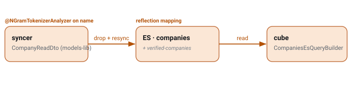

# N-gram substring search on company name

`CDR-0010` · **shipped** · 2026-08-28 · hristo.savov@ship.cars · real

**Services:** `syncer`, `cube`

## Context

Dispatchers search carriers by partial name substrings. The company `name` field carries ngram analysis so prefix/substring matches work. **This documents the real shipped mapping.** Because the mapping is reflection-derived, the analyzer lives as an annotation on the DTO, and any change to it is a drop-and-rebuild — there are no aliases. **Blast radius:** syncer (CompanyReadDto annotation) → `companies` (and `verified-companies`) rebuild → cube query builder.

## §2b · Elasticsearch

*Mapping delta · companies (CompanyReadDto)*

| ES field | Java field : type | ES type | Change | Analyzer |
| --- | --- | --- | --- | --- |
| `name` | `name : String` | `text + keyword` | changed | `none → ngram` |

## Where it lives & how it's wired

| Aspect | Detail |
| --- | --- |
| writer | syncer |
| DTO | `cars.ship.modelslib.readmodels.es.CompanyReadDto` |
| reader | cube · CompaniesEsQueryBuilder |
| resyncer | `CompanyIndexResyncer (companies + verified-companies)` |
| index | companies (no alias) |
| analysis | class @NGramAnalysis · min 1 / max 30 |
| mapping | DTO reflection |
| rollout | drop + full resync |

## Rollout

**§5 · rollout — the risky step ⚠️**

> `CompanyIndexResyncer.initializeIndex()` deletes and recreates **both** `companies` and `verified-companies`, then streams a full resync. The ngram annotation on `name` is already in place; documenting it this way captures *why* any analyzer change here is a rebuild, not a hot mapping update — schedule the window and note the search-degradation interval.
