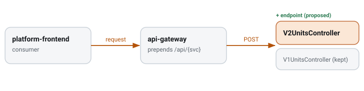

# Cursor-paged /v2 inventory units endpoint

`CDR-0011` · **proposed** · 2026-08-28 · hristo.savov@ship.cars

**Services:** `inventory-backend`, `platform-frontend`

## Context

Today inventory listing is `POST /v1/units` with an `InventoryFilterDto` body, offset-paged via Spring `Pageable` (`page`/`size`/`sort`), returning `PageInventoryUnitsDto`. Offset paging degrades on deep pages. **Decision:** add a `/v2` with cursor paging in a new `rest/v2` package; `/v1` untouched. **Blast radius:** inventory-backend controller + response DTO, platform-frontend consumer. No data, event, or ES change. *(V2* names are proposed — no `rest/v2` exists yet.)*

## §4 · REST API & DTO

*Endpoint · inventory-backend · Spring Boot 3.2.12 · springdoc*

| In-code | External | Method | Change | Request DTO | Response DTO |
| --- | --- | --- | --- | --- | --- |
| `/v1/units` | `/api/inventory/v1/units` | POST |  | `InventoryFilterDto` | `PageInventoryUnitsDto (current · offset)` |
| `/v2/units` | `/api/inventory/v2/units` | POST | added | `InventoryFilterDto` | `PageInventoryUnitsV2Dto` |

*DTO field delta · proposed PageInventoryUnitsV2Dto*

| DTO | Field | Type | Change | JSON name |
| --- | --- | --- | --- | --- |
| `PageInventoryUnitsV2Dto` | `items` | `List<InventoryUnitDto>` | added | `items` |
| `PageInventoryUnitsV2Dto` | `nextCursor` | `String` | added | `nextCursor` |

## Where it lives & how it's wired

| Aspect | Detail |
| --- | --- |
| service | inventory-backend · api-services + inventory-dtos |
| current | `V1UnitsController · POST /v1/units (offset, PageDto)` |
| stack | Spring Boot 3.2.12 · springdoc (Swagger v3) |
| proposed | `V2UnitsController (new · rest/v2)` |
| paths | `V1ApiPathsConstants (+ V2 constant)` |
| consumers | platform-frontend |

## Rollout

**§5 · rollout ℹ️**

> Purely additive; `/v1` stays. The list today is `POST /v1/units` (filter in body), offset-paged — v2 keeps the POST-with-body shape but returns a cursor. Track platform-frontend migration before any `/v1` removal (its own CDR).
