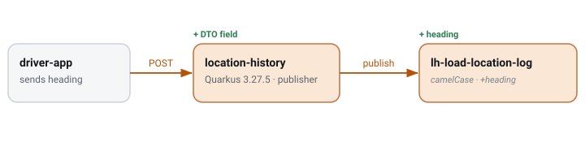

# GPS heading on location-log events

`CDR-0013` · **accepted** · 2026-08-28 · hristo.savov@ship.cars

**Services:** `location-history-backend`, `syncer`

## Context

The driver app reports compass heading; propagate it on the location-log event for ETA refinement. The published record has `id`, `loadId`, `location{latitude,longitude}`, `status`, `driverId`, `carrierId`, `shipperId`, `shipperLoadId`, `createdAt` — no `heading` yet. **Decision:** add it additively; tolerant readers (`@JsonIgnoreProperties`) absorb it. **Blast radius:** location-history-backend publisher + record DTO; syncer `LHLogIndexListener` consumes; the matching ES field on `lh-load-location-logs` follows in a linked CDR.

## §3 · Pub/Sub event

*Payload delta · lh-load-location-log.events (LoadLocationLogMsgPubSubDto)*

| Field | Type | Change | JSON name | Subscriber action |
| --- | --- | --- | --- | --- |
| `heading` | `Double` | added | `heading` | syncer LHLogIndexListener reads it; others tolerate |

## Where it lives & how it's wired

| Aspect | Detail |
| --- | --- |
| topic | `cars.ship.{env}.lh-load-location-log.events` |
| envelope | `LoadLocationLogMsgPubSubDto (Java record)` |
| dialect | camelCase (no @JsonProperty) |
| contract | published record · @JsonIgnoreProperties(ignoreUnknown=true) |
| producer | location-history-backend · PubSubPublisher → PubSubPublisherSync |
| config key | `locationhistory.config.load-location-log-topic` |
| version | additive, tolerant reader |
| consumer | syncer → ES lh-load-location-logs |

## Rollout

**§5 · rollout ℹ️**

> Additive and tolerant-reader safe. Deploy the publisher whenever ready; consumers read `heading` when they choose. syncer maps `location.latitude/longitude` into a `GeoPointReadDto`; the new ES field on `lh-load-location-logs` is a separate resync — split into a linked CDR so this one carries no ES risk.
