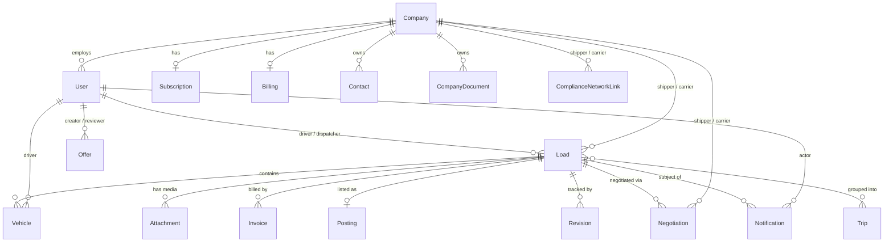
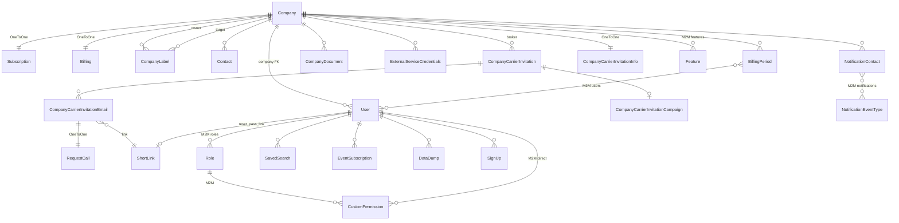
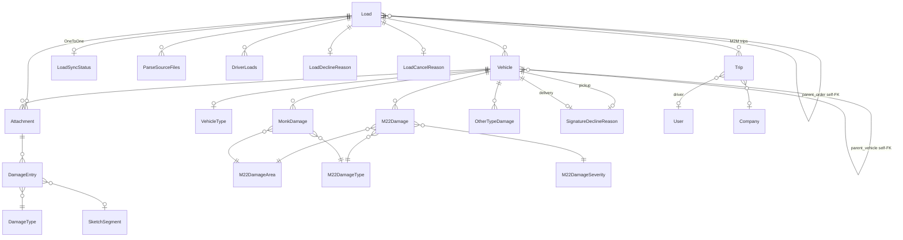
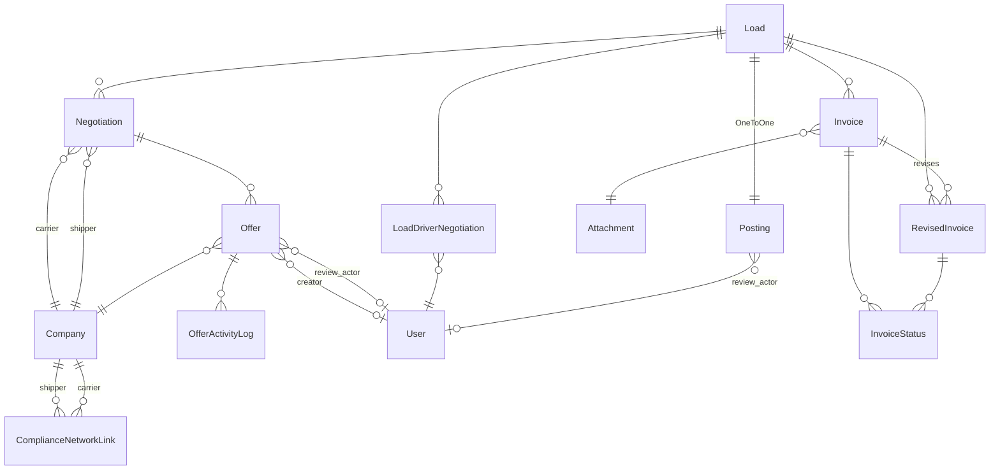
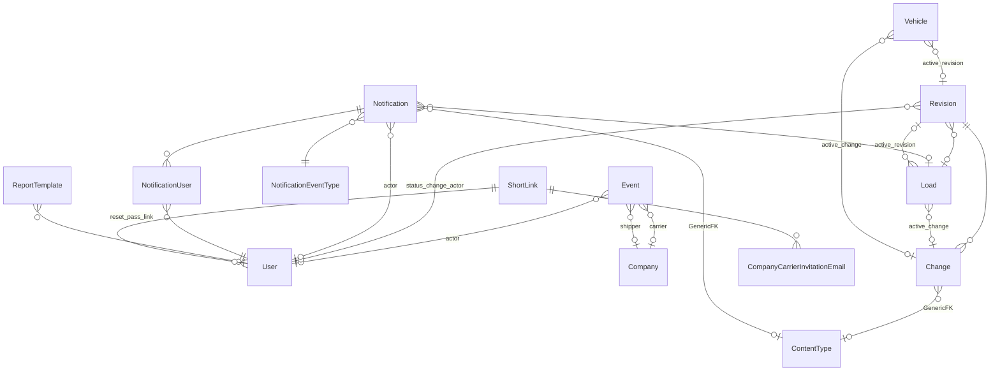

# `platform-backend` Data Model

Complete inventory of every Django model class in the Ship.Cars Loadmate Django monolith (`~/projects/ship-cars-usa/platform-backend/`), plus visual ER representation. Extracted 2026-05-15 from commit `1d5c2e6`.

**Headline: 62 model classes** (2 abstract, 4 unmanaged DB views, 56 concrete tables) across 10 Django apps. The monolith centers on **3 hub entities**: `users.Company`, `users.User`, and `epod.Load` — the FK targets that everything else points to.

Apps with no models (verified): `documents/` (PDF helpers only), `location_tracking/` (Redis structures + serializers), `api/`, `pubsub/`, `user_management_integration/`.

---

## Entity Inventory by Domain

Concrete tables only unless noted. **Bold = hub entity** (5+ inbound FKs).

### 1. Identity & Access — `users` app

| Model | File | Notes |
|---|---|---|
| **User** | `users/models/user_models.py` | AbstractBaseUser + PermissionsMixin. ~1000 LOC. `email` USERNAME_FIELD; driver flags (`is_driver`, `truck_capacity`, `truck_enclosed`); profile media; `roles` M2M; `custom_permissions` M2M; `company` FK. |
| Role | `users/models/user_models.py` | M2M to CustomPermission (+ `extra_custom_permissions` M2M). |
| CustomPermission | `users/models/user_models.py` | name + codename. Custom manager. |
| Feature | `users/models/user_models.py` | Feature flags, cached manager. |
| EventSubscription | `users/models/user_models.py` | FCM / Pub/Sub / SQS external subscription per user. `unique_together(user, external_id)`. |
| SavedSearch | `users/models/user_models.py` | Per-user query JSON + notification toggles. |
| DataDump | `users/models/user_models.py` | File + JSON export bundle. |
| SignUp | `users/models/user_models.py` | Lead capture pre-User. |
| WhatIsNew | `users/models/user_models.py` | Release-note feed item. |
| BillingPeriod | `users/models/user_models.py` | Company billing window; M2M `users`. |

### 2. Companies, Contacts & Onboarding — `users` app

| Model | File | Notes |
|---|---|---|
| **Company** | `users/models/user_models.py` | ~230 LOC. `is_shipper` / `is_carrier` / `is_api_integrator` flags; DOT/MC numbers; SaferWatch hooks; CD (Central Dispatch) alias; `features` M2M. |
| Subscription | `users/models/user_models.py` | OneToOne Company. Trial / free-load counters. |
| Billing | `users/models/accounting_models.py` | OneToOne Company (PK). Invoicing + factoring + bank account. Auto-created via post_save signal. |
| CompanyLabel | `users/models/user_models.py` | Self-M2M-ish Company→Company labeling (owner, target). |
| Contact | `users/models/user_models.py` | Per-Company contact directory; emails ArrayField, phones JSONField. |
| NotificationContact | `users/models/user_models.py` | Contact → `notifications.NotificationEventType` M2M. |
| CompanyDocument | `users/models/user_models.py` | Per-Company file uploads w/ status. |
| CompanyCarrierInvitation | `users/models/user_models.py` | Broker-initiated invite batch. |
| CompanyCarrierInvitationInfo | `users/models/user_models.py` | DOT-keyed FMCSA enrichment per invitation. |
| CompanyCarrierInvitationCampaign | `users/models/user_models.py` | Named campaign + report file. |
| CompanyCarrierInvitationEmail | `users/models/user_models.py` | Per-recipient invitation email + ShortLink. |
| RequestCall | `users/models/user_models.py` | Phone-number callback request, OneToOne to invitation email. |
| ExternalServiceCredentials | `users/models/user_models.py` | Per-Company third-party creds JSON. |
| DriverLoads | `users/models/user_models.py` | Driver↔Load assignment audit (FK epod.Load + FK User + BillingPeriod). |

### 3. Orders / Loads / Trips — `epod` app

| Model | File | Notes |
|---|---|---|
| **Load** | `epod/models.py` | The monolith's center of gravity — ~3000 LOC, ~150 fields. Statuses new→accepted→assigned→picked-up→delivered→archived. Pickup/delivery/customer sections, geo PointFields, money decimals, ATG/tracking flags, source sync. FKs: carrier, shipper, dispatcher, driver, trip, parent_order (self), decline_reason, cancel_reason, active_change, active_revision. M2M to Trip. |
| Trip | `epod/models.py` | Multi-load route container. FKs driver (User), company. |
| LoadDeclineReason | `epod/models.py` | Slug + text lookup. |
| LoadCancelReason | `epod/models.py` | Slug + text lookup. |
| SignatureDeclineReason | `epod/models.py` | Slug + text lookup. |
| LoadSyncStatus | `epod/models.py` | OneToOne Load. Two-stage pickup/delivery sync telemetry; OS/network metadata. |
| ParseSourceFiles | `epod/models.py` | OCR/parse input + result per Load. FK creator (User), load. |
| ArchivedLoad | `epod/models.py` | JSON snapshot of archived Load. |
| Version | `epod/models.py` | Mobile client version lookup. |
| Action | `epod/models.py` | Name-only enum table. |

### 4. Vehicles, Inspections & Damages — `epod` app

| Model | File | Notes |
|---|---|---|
| **Vehicle** | `epod/models.py` | ~570 LOC. VIN/year/make/model, geo + odometer for pickup & delivery, photos count, Monk.ai integration, drivetrain. FKs load, type, driver, parent_vehicle (self), active_change/revision, signature_decline_reason×2. |
| VehicleType | `epod/models.py` | Name + landscape/portrait images. |
| **Attachment** | `epod/models.py` | ~620 LOC. The polymorphic media model — photos, signatures, documents, BOLs. PointField location. FKs load, vehicle, creator, segment. Custom `ActiveAttachmentManager`. |
| SketchSegment | `epod/models.py` | Sketch coordinate region (x0/y0/x1/y1). |
| DamageType | `epod/models.py` | Legacy damage taxonomy. |
| DamageEntry | `epod/models.py` | Damage location on Attachment + DamageType + SketchSegment. |
| M22DamageArea | `epod/models.py` | M22 standard taxonomy (area code). |
| M22DamageType | `epod/models.py` | M22 type code. |
| M22DamageSeverity | `epod/models.py` | M22 severity code. |
| M22Damage | `epod/models.py` | M22 damage per Vehicle. |
| MonkDamage | `epod/models.py` | Monk.ai-generated damage per Vehicle. |
| OtherTypeDamage | `epod/models.py` | Free-form damage with type + location strings. |

### 5. Invoicing — `epod` app

| Model | File | Notes |
|---|---|---|
| BaseInvoice (abstract) | `epod/models.py` | Shared invoice fields (bill_to_*, services JSON, payment_*). |
| Invoice | `epod/models.py` | Concrete invoice; FK load + attachment. |
| RevisedInvoice | `epod/models.py` | Revision of Invoice with `revision_number`. |
| InvoiceStatus | `epod/models.py` | Per-recipient send/open status. FK invoice or revision. `unique_together(invoice, recipient, status, external_id)`. |

### 6. Loadboard — `loadboard` app

| Model | File | Notes |
|---|---|---|
| Posting | `loadboard/models.py` | OneToOne to `epod.Load`. Statuses active/inactive/booked/claimed. |
| Negotiation | `loadboard/models.py` | FK order (Load), carrier (Company), shipper (Company), last_offer. |
| BaseOfferStatus (abstract) | `loadboard/models.py` | Shared review_status enum. |
| Offer | `loadboard/models.py` | FK negotiation, company, creator (User), review_actor (User). offer JSON. |
| OfferActivityLog | `loadboard/models.py` | FK offer, actor. Audit trail of status changes. |
| LoadDriverNegotiation | `loadboard/models.py` | FK load + user; type instant_booked/negotiated. `unique_together(load, user, type)`. |
| ArchivedPosting | `loadboard/models.py` | JSON snapshot. |

### 7. Compliance & Network — `compliance_network` app

| Model | File | Notes |
|---|---|---|
| ComplianceNetworkLink | `compliance_network/models.py` | The shipper↔carrier verification edge. FKs shipper (Company), carrier (Company). Statuses NOT_VERIFIED/UNDER_REVIEW/VERIFIED/SUSPENDED/NOT_VERIFIED_OFFERED. `unique_together(shipper, carrier)`. |

### 8. Notifications — `notifications` app

| Model | File | Notes |
|---|---|---|
| NotificationEventType | `notifications/models.py` | Slug + category (broker/driver/general/loadboard/hidden). |
| Notification | `notifications/models.py` | FK event_type, load (epod.Load), actor (User). GenericForeignKey extra_object. `users` M2M through NotificationUser. |
| NotificationUser | `notifications/models.py` | Per-user delivery state (read, seen). |

### 9. Change Tracking — `changes` app + `epod.Event`

| Model | File | Notes |
|---|---|---|
| Revision | `changes/models.py` | FK load (epod.Load), status_change_actor (User). Statuses pending/accepted/declined/new. |
| Change | `changes/models.py` | FK revision; GenericForeignKey to any object via content_type + object_id. new_values/original_values JSON. |
| Event | `epod/models.py` | App-level event/audit log row. FKs actor (User), carrier (Company), shipper (Company). |

### 10. Misc / Stats / Reporting

| Model | File | Notes |
|---|---|---|
| ShortLink | `shortner/models.py` | URL shortener with expiration. Used by User.reset_pass_link and CompanyCarrierInvitationEmail.link. |
| ReportTemplate | `report_templates/models.py` | Per-user JSON report definition. |
| ActivePostings *(unmanaged view)* | `company_stats/models.py` | DB view keyed by shipper_id. |
| PostedPostings *(unmanaged view)* | `company_stats/models.py` | DB view, last-month counts. |
| Carriers *(unmanaged view)* | `company_stats/models.py` | DB view, trusted carrier counts. |
| Negotiations *(unmanaged view)* | `company_stats/models.py` | DB view, negotiation counts. |

---

## Hub-Entity Relationship Summary

Most non-trivial models point at one of three hubs:

- **`users.Company`** (carrier OR shipper OR both): ComplianceNetworkLink × 2, Negotiation × 2, Event × 2, Offer, Subscription, Billing, CompanyLabel × 2, CompanyDocument, ExternalServiceCredentials, Contact, NotificationContact, CompanyCarrierInvitation, CompanyCarrierInvitationInfo, BillingPeriod, User. `is_shipper` / `is_carrier` flags discriminate role; the same Company row can be both on different Loads.
- **`users.User`**: every actor/audit FK in the system — DriverLoads, Notification.actor, Vehicle.driver, Load.driver, Load.dispatcher, Trip.driver, Posting.posting_review_actor, Offer.creator/review_actor, Change/Revision actors, EventSubscription, SavedSearch, DataDump, ParseSourceFiles.creator, NotificationUser, ReportTemplate, BillingPeriod (M2M), …
- **`epod.Load`**: Vehicle, Attachment, Invoice, RevisedInvoice, ParseSourceFiles, LoadSyncStatus, DriverLoads, Notification, Revision, Posting (OneToOne), Negotiation, LoadDriverNegotiation, Load (self via parent_order), and `Load.trips` M2M to Trip.

---

## Visual Representation

Five Mermaid `erDiagram` views — one global hub map and four domain zooms.

### Diagram 1 — Top-level hub map

### Diagram 2 — Identity, Company, Onboarding

### Diagram 3 — Load, Trip, Vehicle, Inspections, Damages

### Diagram 4 — Loadboard, Compliance, Invoicing

### Diagram 5 — Events, Changes, Notifications, Misc

---

## Architectural Observations

Observations on the *data model* itself, surfaced because they shape any future work touching this schema:

1. **`epod.Load` is a 150-field god-table.** ~3000 LOC class. Pickup/delivery/customer sections are denormalized side-by-side; payment, tracking, ATG, source-sync, and audit metadata all live in the same row. Any schema change risks lock duration and migration cost. New columns should justify why they cannot live on `Vehicle`, `Trip`, `Invoice`, or a side table.
2. **Company plays four roles via boolean flags** (`is_shipper`, `is_carrier`, `is_api_integrator`, `is_single_owner_operator`). The same row is both shipper and carrier on different Loads. FK relationships are *unconstrained at the DB level* w.r.t. role — `limit_choices_to` is admin-only. Application code must enforce the right flag on every read.
3. **Two parallel damage taxonomies coexist** — the legacy `DamageType` / `DamageEntry` / `SketchSegment` system attached to Attachments, and the newer M22 standard (`M22Damage*` + `MonkDamage` for AI-generated entries). Both are populated in production; analytics queries need to union them.
4. **Change-tracking is itself a foreign concern.** `Load.active_revision` / `active_change` and `Vehicle.active_revision` / `active_change` couple business tables to the audit table. `changes.Change` then uses a `GenericForeignKey` back to any object — a circular dependency that prevents schema-isolated extraction.
5. **`Notification.extra_object` and `Change.object` are GenericForeignKeys.** Cannot be enforced by DB FK constraints; orphaned rows are possible after cascading deletes elsewhere. Any migration to a typed schema needs to fan out these.
6. **`company_stats` is four unmanaged DB views.** `managed = False` — read-only, populated by SQL (likely materialized views or replication). Treat as a separate boundary; do not migrate via Django migrations.
7. **No FK from `epod` → `users` in the strict sense.** Django uses `settings.AUTH_USER_MODEL` in Load.dispatcher / manual_pickup_user / manual_delivery_user, but plain `users.User` everywhere else. Both resolve to the same model in this codebase — flagged in case a future split changes that.
8. **`Posting` is 1-to-1 with `Load`** but most of the loadboard surface (Negotiation, Offer) FKs back to Load directly, not Posting. The relational story is asymmetric — Posting is closer to a status flag for Load than an independent aggregate.
